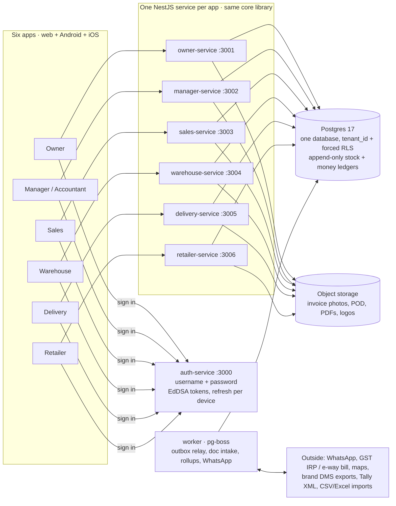
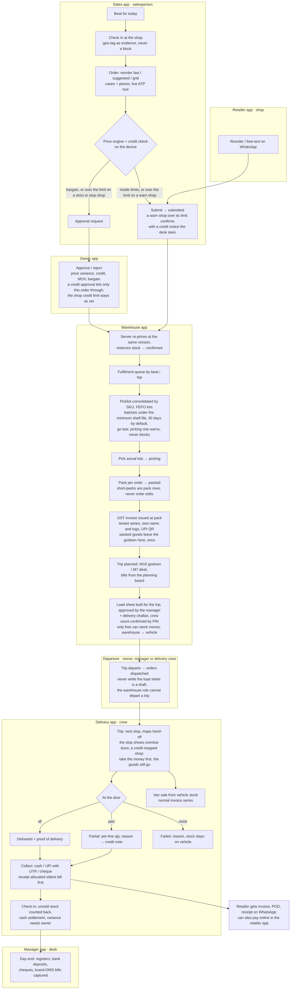
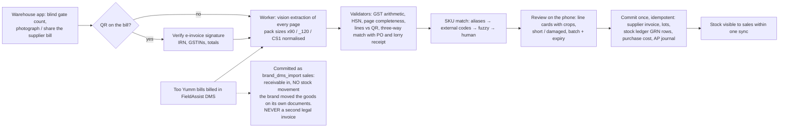
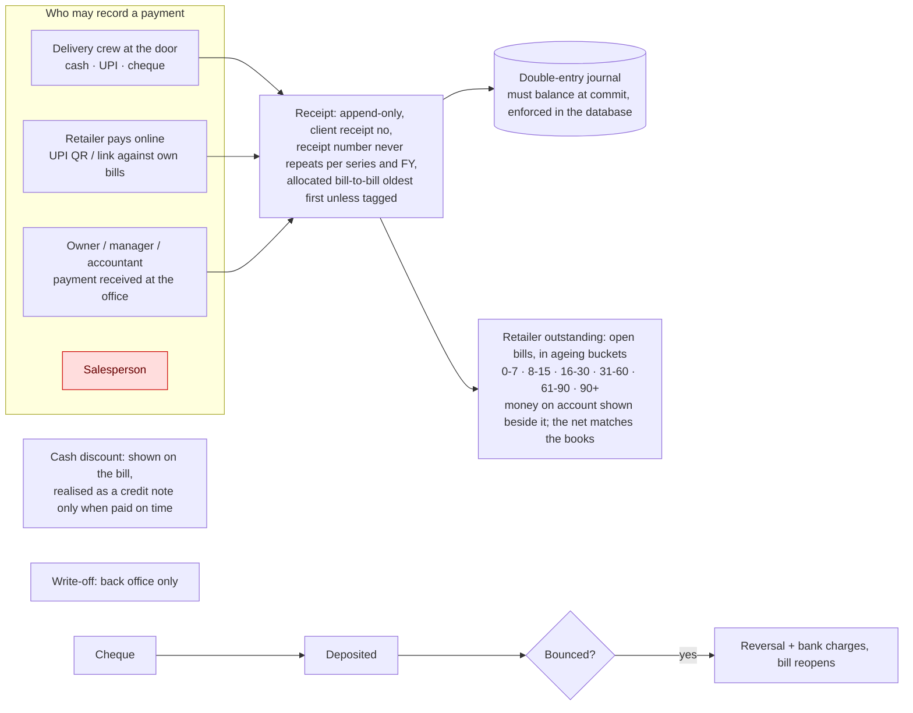
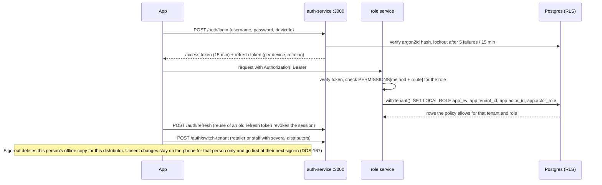

# Distribution OS — single source of truth

**What this file is.** The one document that survives everything: context compression in Claude sessions, laptop sleeps, model
switches, a new developer. It holds the product's _shape_ (who uses which app, how work and money flow between the apps, the rules
that can never be broken) and the _founder's decisions_, each dated. It is short on purpose, so it is read in full at the start of
every session. Where it points to another document, that document holds the detail; where it states a rule, this file wins.

**How it is kept true.**

1. Any founder decision, correction or new requirement is written into this file **in the same turn it is given** (the decisions
   register in §8 and, if a flow changed, the diagram it changed). The build status is _not_ kept here: that lives in
   `docs/18-build-log.md` and changes every hour; this file changes only when the product changes.
2. Every session reads this file first, before `docs/18-build-log.md` (`CLAUDE.md` says so).
3. Diagrams are Mermaid text, so they diff in git, render on GitHub
   (https://github.com/prajwalchavan/Distribution-OS/blob/main/docs/22-source-of-truth.md) and in the Claude desktop app, and can be
   edited without a drawing tool. `docs/design/five-apps-flow-atlas.html` was the earlier, five-app illustrated version; it is kept
   as history and is superseded by this file wherever the two disagree.
4. The change log in §11 records every edit with its date and source (founder message, review, build).

---

## 1. The product in five lines

Distribution OS is a multi-tenant SaaS for Indian FMCG distributors (manufacturer → **distributor** → retailer), sold by subscription
to the distributor. One distributor is one **tenant**; every rupee and every piece of stock is recorded in append-only ledgers under
that tenant. Six apps, one per role, each talking to its own backend service, all on one Postgres database with row-level security.
The pilot customer is **Tarsun Enterprises, Kalyan West** (Too Yumm on FieldAssist DMS, Campa, MOM makhana; ~36 shops in the demo
data). Solo founder; built for lakhs of users from day one; local database with dummy data first, deployment later.

## 2. People, apps and services

Founder decision (2026-09-04): **every role gets its own app**; the manager and the accountant share one. Each app has its own backend
service so a role can only reach the endpoints its service mounts; the permission matrix then decides per endpoint inside that.

| #   | App (package)                        | Who signs in                              | Device                            | Service : port             | What they do there                                                                                                                          |
| --- | ------------------------------------ | ----------------------------------------- | --------------------------------- | -------------------------- | ------------------------------------------------------------------------------------------------------------------------------------------- |
| 1   | Owner (`frontend/owner-app`)         | `owner`                                   | Web + Android + iOS (one code)    | `owner-service` : 3001     | Day numbers **with graphs** (growth, performance), approvals, live map, prices, schemes, credit, settings, **own branding**, imports        |
| 2   | Manager (`frontend/manager-app`)     | `manager`, `accountant`                   | Web + Android + iOS (one code)    | `manager-service` : 3002   | Order queue, GRN review, billing desk, day-end, registers, Tally export (accountant: read + exports)                                        |
| 3   | Sales (`frontend/sales-app`)         | `salesperson`                             | Web + Android + iOS; offline      | `sales-service` : 3003     | Beat, shop check-in, order entry, bargain request, visits, own targets. **Never sees cost, never collects money**                           |
| 4   | Warehouse (`frontend/warehouse-app`) | `warehouse`                               | Web + Android + iOS (one code)    | `warehouse-service` : 3004 | Gate count, scan supplier bills, pick, pack (invoice is issued here), load sheets, challans                                                 |
| 5   | Delivery (`frontend/delivery-app`)   | `delivery`                                | Web + Android + iOS; offline, GPS | `delivery-service` : 3005  | Trip, stops, proof of delivery, returns, **collect cash / UPI / cheque**, van sales, settlement                                             |
| 6   | Retailer (`frontend/retailer-app`)   | `retailer` (one login, many distributors) | Web + Android + iOS; online only  | `retailer-service` : 3006  | See bills and outstanding, reorder, **pay online**, track delivery; one card per linked distributor                                         |
| 7   | Admin (`frontend/admin-app`)         | `platform_admin` (Distribution OS staff)  | Web + Android + iOS (one code)    | `admin-service` : 3007     | Onboard distributors, plans and subscription state, support-access grants (time-boxed, owner-approved, audited). v1 per founder 2026-09-05. |
| —   | Sign-in for all six                  | every role                                | —                                 | `auth-service` : 3000      | Username + password, our own tokens; switch distributor for users with more than one membership                                             |
| —   | Worker (`backend/worker`)            | system                                    | —                                 | pg-boss                    | Outbox relay, retention, document intake jobs, rollups, notifications                                                                       |

Every service has `/health`, `/swagger`, `/docs` and `/docs/openapi.json`. All demo passwords are `Dos@1234`; usernames are in
`docs/18-build-log.md`.

## 3. System map

Rules that shape the map: a service serves only its roles (any other role gets 403 before business logic); every endpoint has a row in
the permission matrix (`backend/libs/contracts/src/permissions.ts`) and the guard fails closed on an undeclared route; every service is
stateless and can run as many copies as needed; the database is the only shared state.

## 4. The loop every order travels (order to cash)

The three state machines behind this loop are the code in `backend/libs/domain/src/state-machines/` and the apps never set a state
column by hand:

- **Order**: draft → submitted → confirmed → picking → packed → dispatched → delivered | partially_delivered → closed. Cancel: a shop while draft or submitted, a rep up to confirmed, the desk (owner, manager) up to picking, with the picker told which lines to put back; a packed order only through its bill; after dispatch only a credit note (QA DOS-138). `return_undelivered` sends dispatched back to packed.
- **Trip**: planned → loading → active → closing → settled | settled_with_variance; **stop**: pending → started → arrived → delivered |
  partial | failed.
- **Invoice**: draft → issued → partially_paid → paid; issued may be written_off or cancelled (before dispatch and before any money);
  once money lands the only correction is a credit note. "Overdue" is computed, never stored.

## 5. Stock in: supplier bill to goods received (zero typing except the gate count)

Purchase cost lands in `tenant_product_costs`, which only owner, manager, accountant and system can read. That is a database rule with
tests, not an app rule.

Goods from a supplier come in only on a goods receipt. By hand, only the owner or a manager adds stock or posts opening stock; the
warehouse login only takes stock off (damaged, expired, a correction, a count found short), and more on the rack than the books show is
a cycle count the desk posts (QA DOS-044). The accountant reads stock, supplier bills, goods receipts and inbound documents and changes
none of them; photographing a bill is unchanged (QA DOS-037).

## 6. Money: who may touch it and where it goes

Founder rule (2026-09-04): **the salesperson never collects money** — the sales service has no receipt endpoint and the matrix never
grants one. Cash on a vehicle counts toward expected cash at settlement; variance beyond the owner's tolerance blocks trip close. Cash and cheques from a trip reach the bank only after that trip settles (QA DOS-132, 2026-09-13).

## 7. Sign-in and permissions

**Platform console levels (founder, 2026-09-12).** The console's token role is always `platform_admin`; its level narrows what it may do,
and the server enforces it on every console action: **super** does everything (onboard, suspend and reactivate, plans, lock and unlock
logins, support access); **support** reads everything and may only ask for and hand back support access to a distributor; **billing**
reads everything and may only change a distributor's plan.

**Order changes (founder, 2026-09-13, QA DOS-115).** Warehouse, delivery and accountant logins cannot create (including repeat last
order), re-line, submit or cancel an order, online or by device upload; they still read orders. **Offline uploads (founder, 2026-09-13, QA DOS-166).** `/sync/upload` checks every operation against the same
permission matrix, so the offline route can never do what the normal endpoint refuses. **Stock and supplier bills (founder,
2026-09-13, QA DOS-037, DOS-044).** Only the owner and the manager add stock or record opening stock; the accountant views supplier bills,
goods receipts and stock without changing them.

OTP (SMS / WhatsApp) is a **later enhancement layered on top** of username + password, not a replacement. Distribution OS branding
appears only on the sign-in screen; inside every app and on every printed document the distributor sees their **own** name and logo.

## 8. Founder decisions register (dated; newest last)

| Date       | Decision                                                                                                                                                                                                                                                                                                                                                                                                                                                                                                                                                                                                                                                                                                                                                                                                                                      | Where it is enforced / detailed                                                                                                                                                |
| ---------- | --------------------------------------------------------------------------------------------------------------------------------------------------------------------------------------------------------------------------------------------------------------------------------------------------------------------------------------------------------------------------------------------------------------------------------------------------------------------------------------------------------------------------------------------------------------------------------------------------------------------------------------------------------------------------------------------------------------------------------------------------------------------------------------------------------------------------------------------- | ------------------------------------------------------------------------------------------------------------------------------------------------------------------------------ |
| 2026-08    | TypeScript everywhere; van sales allowed (vehicle is a stock location); GPS tracking of delivery staff; iOS + Android; revenue = distributor subscription; no fintech                                                                                                                                                                                                                                                                                                                                                                                                                                                                                                                                                                                                                                                                         | docs/15 F-series, ADR 0013                                                                                                                                                     |
| 2026-08    | Tarsun bills from TradeEzee (Windows ERP); Too Yumm runs on FieldAssist DMS; coexist by import, never a second legal invoice                                                                                                                                                                                                                                                                                                                                                                                                                                                                                                                                                                                                                                                                                                                  | docs/15 F4–F5, ADR 0014, docs/05                                                                                                                                               |
| 2026-09-04 | Repo root holds only `backend/`, `frontend/`, `docs/`, `CLAUDE.md`; every service and app an independent package                                                                                                                                                                                                                                                                                                                                                                                                                                                                                                                                                                                                                                                                                                                              | docs/19                                                                                                                                                                        |
| 2026-09-04 | **Six apps, one per role**; manager and accountant share; each app on its own backend service; one Postgres database the founder views in DBeaver                                                                                                                                                                                                                                                                                                                                                                                                                                                                                                                                                                                                                                                                                             | §2 above, docs/19, docs/21                                                                                                                                                     |
| 2026-09-04 | **Username + password**, our own token service, no third party; OTP and resend-OTP are a future enhancement                                                                                                                                                                                                                                                                                                                                                                                                                                                                                                                                                                                                                                                                                                                                   | auth module, §7                                                                                                                                                                |
| 2026-09-04 | **Permission matrix**: which role may call which endpoint, tested for every endpoint × every role                                                                                                                                                                                                                                                                                                                                                                                                                                                                                                                                                                                                                                                                                                                                             | `permissions.ts`, `describePermissionMatrix`                                                                                                                                   |
| 2026-09-04 | **Backend first, production grade on the local database**; every endpoint of every service built and tested; then the six apps one at a time                                                                                                                                                                                                                                                                                                                                                                                                                                                                                                                                                                                                                                                                                                  | CLAUDE.md, docs/18                                                                                                                                                             |
| 2026-09-04 | Swagger on every service with **sample payloads that actually work** (built from demo rows, not placeholders)                                                                                                                                                                                                                                                                                                                                                                                                                                                                                                                                                                                                                                                                                                                                 | `/swagger`, `pnpm smoke`                                                                                                                                                       |
| 2026-09-04 | Owner app must have **graphs** wherever possible: growth, how the distributorship is performing                                                                                                                                                                                                                                                                                                                                                                                                                                                                                                                                                                                                                                                                                                                                               | reporting module serves chart-ready series                                                                                                                                     |
| 2026-09-04 | UI: Claude proposes the design system, founder reviews; modern look per current standards; **English only** for now; **online-first now, offline for sales + delivery before the pilot**; **Android and iOS**; haptics and "feel good"                                                                                                                                                                                                                                                                                                                                                                                                                                                                                                                                                                                                        | docs/design/UX-00…03                                                                                                                                                           |
| 2026-09-04 | **3–4 layout mockups as images before any frontend code**; founder picks one letter for all six apps, **after the backend is complete**                                                                                                                                                                                                                                                                                                                                                                                                                                                                                                                                                                                                                                                                                                       | artifact link in docs/18; A Ledger / B Instrument / C Panel / D Signal                                                                                                         |
| 2026-09-04 | Invoice series: per-tenant configuration, never hard-coded (cut-over series undecided)                                                                                                                                                                                                                                                                                                                                                                                                                                                                                                                                                                                                                                                                                                                                                        | docs/17 §D1, `numbering_series`                                                                                                                                                |
| 2026-09-04 | Cash discount: not important now; realised at receipt only                                                                                                                                                                                                                                                                                                                                                                                                                                                                                                                                                                                                                                                                                                                                                                                    | docs/17 §D2                                                                                                                                                                    |
| 2026-09-04 | Shops **are** GST-registered: B2B tax invoice is the primary document; B2C path kept for shops without GSTIN                                                                                                                                                                                                                                                                                                                                                                                                                                                                                                                                                                                                                                                                                                                                  | docs/17 §D3                                                                                                                                                                    |
| 2026-09-04 | **Only delivery collects money, or the shop pays online; the salesperson never does**; desk may record office payments                                                                                                                                                                                                                                                                                                                                                                                                                                                                                                                                                                                                                                                                                                                        | docs/17 §D4, §6 above                                                                                                                                                          |
| 2026-09-04 | No van-sale numbering: van sales use the normal invoice series                                                                                                                                                                                                                                                                                                                                                                                                                                                                                                                                                                                                                                                                                                                                                                                | docs/17 §D5                                                                                                                                                                    |
| 2026-09-04 | **No brand exists: create one.** Product is **white-labelled**: each distributor sees their own name and logo in the owner app and on every document                                                                                                                                                                                                                                                                                                                                                                                                                                                                                                                                                                                                                                                                                          | docs/17 §D6, `tenant_settings` branding keys                                                                                                                                   |
| 2026-09-04 | Data migration is a **generic importer** (upload → preview → map columns → save profile → dry run → commit) for any source: TradeEzee, Marg, Busy, Tally, FieldAssist, Excel                                                                                                                                                                                                                                                                                                                                                                                                                                                                                                                                                                                                                                                                  | docs/17 §D7, integrations plan                                                                                                                                                 |
| 2026-09-04 | Demo data must cover **three distributors, staff under each, shops linked to more than one distributor**                                                                                                                                                                                                                                                                                                                                                                                                                                                                                                                                                                                                                                                                                                                                      | CLAUDE.md, chain step 11                                                                                                                                                       |
| 2026-09-05 | **Keep developing until a hard blocker**; never stop between backend modules; verify, record, launch next in the same turn                                                                                                                                                                                                                                                                                                                                                                                                                                                                                                                                                                                                                                                                                                                    | CLAUDE.md session protocol, docs/18                                                                                                                                            |
| 2026-09-05 | Commit at module boundaries with a message stating what is complete and what is in progress                                                                                                                                                                                                                                                                                                                                                                                                                                                                                                                                                                                                                                                                                                                                                   | git history                                                                                                                                                                    |
| 2026-09-05 | This file is the single source of truth; updated in the same turn as any founder decision                                                                                                                                                                                                                                                                                                                                                                                                                                                                                                                                                                                                                                                                                                                                                     | §0 rules, CLAUDE.md                                                                                                                                                            |
| 2026-09-05 | **Layout chosen: A Ledger** (of A Ledger / B Instrument / C Panel / D Signal). Applies to all six apps; design system finalised on it.                                                                                                                                                                                                                                                                                                                                                                                                                                                                                                                                                                                                                                                                                                        | docs/design/UX-00-design-system.md, layout artifact                                                                                                                            |
| 2026-09-05 | **Accountant scope = money desk + reads**: may record office receipts, deposits, cheque bounces, write-offs; reads and exports everything; NO prices, schemes, credit limits, approvals or settings.                                                                                                                                                                                                                                                                                                                                                                                                                                                                                                                                                                                                                                          | `permissions.ts` (ACCOUNTANT narrowed), docs/23                                                                                                                                |
| 2026-09-05 | **Manager PIN for load-out is given in the MANAGER app** (manager approves the load sheet from their own phone or desk; the warehouse device waits for it), not typed on the warehouse phone.                                                                                                                                                                                                                                                                                                                                                                                                                                                                                                                                                                                                                                                 | warehouse `loadSheets.confirm` + manager approval, docs/23                                                                                                                     |
| 2026-09-05 | docs/23 screen inventory is binding: the retailer app must be able to PLACE orders (`orders.submit` for the retailer role); the salesperson may SEE a shop's outstanding and credit check (never collect); owner Settings needs branding/numbering/settings endpoints; owner graphs need `reporting.series`.                                                                                                                                                                                                                                                                                                                                                                                                                                                                                                                                  | docs/23, platform-gaps slice in the chain                                                                                                                                      |
| 2026-09-05 | Design system finalised on A Ledger (`docs/design/UX-00-design-system.md`, adversarially reviewed: 17 findings fixed). Brand name still to pick: **Vitran** (recommended) / Bahi / Distribution OS.                                                                                                                                                                                                                                                                                                                                                                                                                                                                                                                                                                                                                                           | UX-00 §3.6, §9, §10                                                                                                                                                            |
| 2026-09-05 | **Product name: Distribution OS.** App names: "Distribution OS - Owner", "Distribution OS - Manager", "Distribution OS - Sales", "Distribution OS - Warehouse", "Distribution OS - Delivery", "Distribution OS - Retailer" (store listing, app icon label, sign-in screen). Inside the apps the distributor's own name shows (white-label).                                                                                                                                                                                                                                                                                                                                                                                                                                                                                                   | UX-00 §10 brand, app packages                                                                                                                                                  |
| 2026-09-05 | **Branches: one tenant = one distributorship** for pilot and v1. Multi-branch is v2: each branch its own tenant plus an owner group view.                                                                                                                                                                                                                                                                                                                                                                                                                                                                                                                                                                                                                                                                                                     | schema (no branch entity), Confluence Personas                                                                                                                                 |
| 2026-09-05 | **AI features are ALL in v1 (before pilot)**: WhatsApp free-text → draft order (LLM parse against the shop's own SKU history, always human-confirmed), voice order capture (speech → same parser), demand forecasting / reorder suggestions for purchase planning, and route optimisation (stop sequencing by distance and time windows, driver may override). This overrides docs/03 "must not build" for routing and the post-pilot deferral.                                                                                                                                                                                                                                                                                                                                                                                               | new module 12 `ai` (intake parsing, voice, forecasting, routing) in the chain                                                                                                  |
| 2026-09-05 | **Positioning stays multi-industry** (FMCG first; pharma, electricals, dairy, agri as markets) while the product remains FMCG-shaped until a second-industry customer appears.                                                                                                                                                                                                                                                                                                                                                                                                                                                                                                                                                                                                                                                                | Confluence Vision / Target Market                                                                                                                                              |
| 2026-09-05 | **Platform console in v1**: a seventh app + service "Distribution OS - Admin" for organisation onboarding, plans and subscription state, support-access grants (time-boxed, owner-approved, audited). Revenue stays subscription; no fintech. **Built 2026-09-06 in the shape below** — `platform_admin` is NOT a membership role and has its own sign-in (`/auth/platform/login`); the console ASKS for support access and only the distributor's own OWNER opens the window (`tenancy.support.approve`); an approved window becomes a five-minute signed `x-support-grant` pass that acts as that owner, GET-only while the scope is read-only, and writes one `platform_audit` row per call; the console reads COUNTS of a distributor's size and never a rupee of its trade; suspending a distributorship refuses every sign-in with 423. | module 13 `platform-admin` (admin-service :3007, admin-app); `libs/core/src/modules/platform-admin/**`, `platform/support-access.ts`, migrations 0033/0034/0035–0037/0039/0042 |
| 2026-09-05 | Confluence space is rewritten from this file (PM/TPM voice); docs/22 stays the source of truth, Confluence mirrors it.                                                                                                                                                                                                                                                                                                                                                                                                                                                                                                                                                                                                                                                                                                                        | docs/24 audit, Confluence pages                                                                                                                                                |
| 2026-09-05 | Founder wants to SEE any frontend under development in the browser as it is built (web build of each app via the Browser pane / launch.json).                                                                                                                                                                                                                                                                                                                                                                                                                                                                                                                                                                                                                                                                                                 | frontend workflow: every app slice ends with a browser check and a screenshot to the founder                                                                                   |
| 2026-09-05 | **Deployment, least cost, no funding (docs/26, all six confirmed): dev stays on the founder's Mac (cloud only for test and prod); Postgres self-managed in a container on the VM until ~10 paying tenants, then RDS; an all-in-one process mode (seven services + worker in one container) is built for small deployments, split later; offline sync is OUR OWN delta sync (no PowerSync; docs/07 superseded on that point); Android first for the pilot, iOS after; Lightsail Mumbai as the starting compute, the docs/11 shape (Fargate, ALB, RDS) only with revenue.**                                                                                                                                                                                                                                                                     |
| 2026-09-05 | **Cost stages (docs/26 §4): stage 0 = first run at ₹0 (free credits, sideloaded APK, stub drivers); stage 1 = 1–10 clients at minimum spend (~$40/mo); stage 2 = thousands, spend to scale. The architecture must carry stage 2 from day one (stateless services, RLS multi-tenancy, replica, S3, expand-only migrations); only the infrastructure under it changes.**                                                                                                                                                                                                                                                                                                                                                                                                                                                                        |
| 2026-09-05 | **Typeface: IBM Plex Sans** for all seven apps (tabular digits at every weight, ₹ glyph, Devanagari sibling with the same digit advance for when Hindi arrives). The last open design token is closed.                                                                                                                                                                                                                                                                                                                                                                                                                                                                                                                                                                                                                                        |
| 2026-09-05 | **Languages: English only for the pilot.** Hindi (and Marathi if the market asks) comes before the second customer. The strings module keeps its locale structure from day one so adding a language is a translation job, never a rewrite.                                                                                                                                                                                                                                                                                                                                                                                                                                                                                                                                                                                                    |
| 2026-09-05 | **AI keys: stub drivers for now.** docint and the `ai` module run on the deterministic engine; `ANTHROPIC_API_KEY` is added to `backend/.env` whenever the founder wants a real bill photo read. Nothing in the build waits on it.                                                                                                                                                                                                                                                                                                                                                                                                                                                                                                                                                                                                            |
| 2026-09-07 | **Every finished app is pushed, not just committed.** The moment an app's gate is green and the build log is updated, the snapshot is committed AND `git push origin main` runs; the same for the backend, which is already fully pushed. The founder wants the remote to always hold every completed piece, so a dead laptop costs nothing.                                                                                                                                                                                                                                                                                                                                                                                                                                                                                                  | frontend chain: commit + push per app slice; CLAUDE.md session protocol                                                                                                        |
| 2026-09-07 | **FRONTEND COMPLETE: all seven apps built and gated green** — owner, manager (accountant on it), sales, warehouse, delivery, retailer and admin, each one Expo codebase serving website + Android + iOS, each verified by an independent gate that walked every screen at desk and phone widths against the live services and the pilot database.                                                                                                                                                                                                                                                                                                                                                                                                                                                                                             | `frontend/<role>-app`; docs/18 status table; `docs/28-running-it-locally.md`                                                                                                   |
| 2026-09-07 | **Fable runs the end-to-end test.** The chain's own F10 end-to-end gate was stopped after the seventh app went green; the founder will drive E2E from a Fable session instead, as the architect role already defines. Nobody re-launches that gate unasked.                                                                                                                                                                                                                                                                                                                                                                                                                                                                                                                                                                                   | `scratchpad/dos-frontend.js` F10 stopped; E2E opens the next session                                                                                                           |
| 2026-09-12 | **QA batch 1 approved.** The 4 P0 and the 30 P1 findings on the order-to-cash chain (QA/findings/09-phase-1-approval-gate.md) are fixed before the cross-role end-to-end phase; the other P1, P2 and P3 wait for the QA backlog. Every subagent runs on Opus; Fable reviews only contract, permission and schema changes, and says when to switch.                                                                                                                                                                                                                                                                                                                                                                                                                                                                                            |
| 2026-09-12 | **Console levels are enforced (QA DOS-106).** super: everything. support: read everything, ask for and hand back support access, nothing else. billing: read everything, change a distributor's plan, nothing else. Only super onboards, suspends, reactivates, locks or unlocks.                                                                                                                                                                                                                                                                                                                                                                                                                                                                                                                                                             |
| 2026-09-12 | **Only the owner, the manager and the delivery crew send a trip out (QA DOS-043).** The warehouse role keeps creating trips, adding stops and starting loading, but can no longer depart a trip, and no trip departs while its load sheet is still a draft.                                                                                                                                                                                                                                                                                                                                                                                                                                                                                                                                                                                   |
| 2026-09-12 | **"Send statement" sends a short text now (QA DOS-007).** A WhatsApp/SMS summary with the balance, the overdue amount and a UPI pay link; the PDF statement comes later.                                                                                                                                                                                                                                                                                                                                                                                                                                                                                                                                                                                                                                                                      |
| 2026-09-12 | **An offline doorstep delivery carries its proof photo inside the queued operation (QA DOS-056).** The photo uploads with the delivery when the network returns; the separate photo staging queue of docs/27 §15 is not built, and docs/27 §15 is updated with the fix.                                                                                                                                                                                                                                                                                                                                                                                                                                                                                                                                                                       |
| 2026-09-12 | **Receipt numbers never repeat (QA DOS-032, DOS-059).** Unique per distributor, series and financial year, enforced by the database; a collision is refused (409 online, a sync rejection offline). The QA database `dos_qa` is rebuilt from the fixed seed once this lands; the founder's own `dos` database is the founder's call.                                                                                                                                                                                                                                                                                                                                                                                                                                                                                                          |
| 2026-09-13 | **QA batch 2 approved: every open finding is fixed.** Founder: "I want to fix everything identified" · "Approved all pending items". Every P0, P1, P2 and P3 finding from the Phase 1 walkthroughs and the batch-1 regression, worked P0 → P1 → P2 → P3. A fix that changes a contract, permission or schema shape without an architect design goes to the architect (Fable) first; the rest are built on Opus, test-first with an independent verifier. |
| 2026-09-13 | **Warehouse and delivery logins cannot create, re-line, submit or cancel an order (QA DOS-115).** Those four order actions leave the warehouse and delivery roles in the permission matrix; both roles still read orders. |
| 2026-09-13 | **Correction to the 2026-09-12 receipt-number row (architect, QA DOS-032, DOS-059).** A receipt number the server assigns that collides is repaired in the same transaction (counter moved past the highest number used, one retry, an audit row), so a lagging counter never stops money recording; a 409 or a sync rejection is only for a number a client supplied itself. The financial year used for numbering is IST everywhere. |
| 2026-09-13 | **Cash still out with a delivery crew is banked only after its trip settles (QA DOS-132).** The Day-end bank register leaves out trip receipts whose trip has not settled, and the server refuses to deposit them. |
| 2026-09-13 | **A damaged or expired return never goes back into saleable stock, at the desk or at the door (QA DOS-116).** A credit note for damaged or expired goods puts its pieces in the damaged bin; marking such a line saleable is refused, the same rule as the doorstep return. |
| 2026-09-13 | **Fable's weekly budget is used in full, as helper agents.** From the Opus session, Fable signs off every fix plan before it is built, designs what needs a decision, reviews each lane before it merges into main, and judges the end-to-end business test. Planners, builders, verifiers and app walkers stay on Opus; no session switch is needed for that work. This replaces the 2026-09-12 rule that every helper agent runs on Opus. |
| 2026-09-13 | **P2 and P3 fixes are built in lean mode.** P0 and P1 keep the full process (plan, review, Fable sign-off, build, verify). P2 and P3 are grouped by app: one builder and one verifier per group of five to eight, no separate planning step; copy-only or layout-only P3 fixes may run on Sonnet; Fable designs the ones that need a decision. One full regression (web, Android, iOS) runs at the end of QA batch 2, and phones are walked only where a fix changes a phone screen. If overall weekly usage passes about 70% by Wednesday, work stops after P0/P1 and its regression, and P2/P3 resume after the Saturday reset. |
| 2026-09-13 | **Every offline upload is checked against the permission matrix (QA DOS-166).** A role that may not make a change through the normal endpoint cannot make it through /sync/upload either; the upload refuses it as a recorded sync rejection, never silently. A salesperson can never record a receipt by any route. Added to QA batch 2 as a P0. |
| 2026-09-13 | **Architect defaults in QA batch 2, approved by the founder.** (1) The accountant cannot create, re-line, submit or cancel an order (DOS-115; follows the 2026-09-05 accountant scope). (2) Confirming a held order applies the rates approved since it was drafted, including a shop's own approved rate, and nothing else: a price-list or scheme edit made in between does not re-price it (DOS-126). (3) Cheques collected on a trip, like its cash, are banked only after the trip settles (DOS-132). (4) Expired goods returned at the desk are booked as damaged; there is no separate expired reason yet (DOS-116). (5) At trip start an emptied 'Cash handed to you' means a ₹0 float; an untouched field keeps the planned float (DOS-146). (6) In the warehouse app a load sheet is always built for one trip and carries only that trip's bills (DOS-131, DOS-137). |
| 2026-09-13 | **More architect defaults in QA batch 2, approved by the founder.** (1) 'Order again' repeats the shop's last placed order, whoever placed it (rep, shop, phone, WhatsApp, van sale), never a draft (DOS-098). (2) The accountant can view inbound documents, supplier invoices, goods receipts and stock (M3, M4, M16) but cannot book, post or adjust anything there, and can still capture supplier bills (DOS-037). (3) Only the owner and the manager add stock or record opening stock; every other role records a count, and new stock arrives only through a goods receipt (DOS-044). (4) The accountant is not a stock adder (DOS-044). (5) No extra confirmation for large stock reductions yet; it follows the iOS dialog fix (DOS-044, DOS-164). |
| 2026-09-13 | **The offline upload door, as built (architect, QA DOS-166).** `/sync/upload` checks each operation against PERMISSIONS through the procedure its table stands for. A role the matrix refuses gets a recorded `role_not_allowed` rejection before anything is written; a write the database policy refuses is recorded as `not_permitted`, never a 500. The database adds its own line: only the owner, manager, accountant, delivery crew and the system may insert a receipt. Never-list #2 names both. |
| 2026-09-13 | **Clarification of the DOS-115 row (architect).** The five order writes (create, repeat last order, re-line, submit, cancel), online or by device upload, belong to the owner, the manager, the salesperson and the shop. The accountant is outside them too, the architect's default under the 2026-09-05 accountant scope, reversible with one role list. The crew sells from the van only through Van sale. Every role still reads orders; narrowing a driver's reads to his trip's orders is Phase 3. |
| 2026-09-13 | **Trips are planned from a planning board (architect, QA DOS-131, DOS-137).** The godown (W10) and the desk (M7) plan a trip from one board: the crew for the date and the packed bills not yet on a trip; a bill rides on one open trip at most. A load sheet is built for a trip, from the bills on it. §4 shows the step. |
| 2026-09-13 | **Doorstep with no signal, as built (founder-approved exception, QA DOS-056, DOS-156).** Only on the no-signal path does a delivery carry its proof photo inline through `/sync/upload`: a JPEG of at most 300 KB, the route capped at 8 MiB, a single operation over 1 MiB recorded as `row_too_large`. The server stores the photo through the files platform and the row keeps only its key. A phone that gets no answer now says "No connection" (DOS-156). At trip start an emptied cash field is sent as ₹0 and written as the trip's float at depart (DOS-146, default (5) above). |
| 2026-09-13 | **Shop ageing is rebuilt every night for every distributor (architect, QA DOS-117).** The 00:20 IST nightly finalize starts one ageing rebuild per distributor and the worker catches up on start-up, so each morning's ageing buckets are dated today. This is how the planned 00:30 ageing snapshot job is realised; no product rule changes. |
| 2026-09-13 | **Unlocking a login, a precision to the 2026-09-12 console-levels row (architect, QA DOS-107).** Only a super administrator unlocks, with a reason of 1 to 500 characters, audited as `user.enabled`. Unlocking a login that is not locked answers 200 and writes nothing. An unlock restores `users.status` only: the sessions the lock ended stay ended, and memberships, `platform_admins.disabled_at` and the 5-failure password lock are untouched. |
| 2026-09-13 | **Order again and confirm pricing, as built (architect, QA DOS-098, DOS-126).** Order again takes the shop's most recently placed order by placement time, builds the basket on the device and writes nothing until Place order. At confirm a line changes only when a rate approved since the draft lowers its net; this is how §4 "Server re-prices at the same version" is read. Precision to the 2026-09-13 architect-default rows above. |
| 2026-09-13 | **Approving an "Over credit limit" request lets only that one order through (QA DOS-006).** The shop's credit limit stays as it is; the approval screen says so and links to the shop's page, where the limit is changed (audited, as today). |
| 2026-09-13 | **"Outstanding" on the owner's home stays the total of open bills (QA DOS-016).** Money already received on account is shown beside it ("less ₹X on account"), and the Money screen states the net dues, which always match Sundry Debtors in the books. Nothing already stored changes meaning. |
| 2026-09-13 | **Minimum shelf life to ship: one number per distributor, 30 days unless the owner changes it in Settings (QA DOS-054).** Stock reservation and the pick sheet pass over a batch with fewer days left whenever another batch can cover the line; a picker who still takes one gets a red warning the desk can see, but is not stopped (FEFO warns, it never blocks). |
| 2026-09-13 | **The crew hands over goods already billed and loaded even when the shop owes, and the stop tells them (QA DOS-066).** The stop shows the overdue amount, the oldest due date and the days late; a shop on credit mode "stop" also gets a "Credit stopped" chip and "take the money before the goods go in". Nothing blocks the delivery on the phone or the server: the credit check stays at order submit. A "strict" shop gets no chip. |
| 2026-09-13 | **A trip expense of ₹200 or more needs a photo of its bill (QA DOS-071).** ₹200 is the default of a per-distributor setting the owner may change (0 = every expense). The server enforces it for the crew and the desk alike, and the phone says why the button is off. |
| 2026-09-13 | **A "Warn at the limit" shop's order over its credit limit goes through with a credit notice (QA DOS-081).** The rep sees "over the limit, warn only" before placing, and the manager's order list and detail show the notice on the confirmed order. "Strict" and "stop" shops are still held for approval. §4 corrected. |
| 2026-09-13 | **"₹15 off per case on 2+" is ₹15 on every case once two are bought (QA DOS-087).** ₹30 on 2 cases, ₹45 on 3. The price engine gains a per-unit amount reward (per case or per piece, above a threshold, with slabs) and the seeded scheme moves to it; flat "per multiple" schemes keep working as they do. |
| 2026-09-13 | **A shop whose order is held is told in the app only (QA DOS-100).** "We have your order, {distributor} will confirm shortly" is an in-app message, not a paid WhatsApp or SMS. The order screen shows the overdue amount with a Pay button and never a credit limit or credit-available figure (ADR 0006). |
| 2026-09-13 | **A shop that buys from several distributors lands in the one it used last on that device (QA DOS-102).** A fresh install lands in the first. One home shows each distributor's dues, last bill and any van on the way, plus the total owed; there is no "choose your distributor" screen. |
| 2026-09-13 | **A shop sees one office number, set by the owner in Settings, for Call and WhatsApp (QA DOS-103).** With no number set there is no button. "Report a problem / ask for a return" lands in the office's inbound queue with its kind and the bill or delivery it names; the desk triages it and the credit note is raised as today, at the door or by the desk. |
| 2026-09-13 | **The desk may cancel an order while it is being picked (QA DOS-138).** The owner or a manager cancels; the stock hold is released, the picker's sheet shows which lines to put back, and no GST invoice is issued. Reps and shops keep today's limits. A packed order is cancelled only through its bill (DOS-139); after dispatch only a credit note corrects it. §4 corrected. |
| 2026-09-13 | **Sign-out leaves nothing of the previous user or distributor on a device (QA DOS-167, P0).** Added to QA batch 2: on a shared phone or browser the next login saw the previous rep's shops, orders and dues, another distributor's after a restart. Never-list #11. Architect design: QA/evidence/batch2/verdicts/DOS-167-design.md; the founder's answer on unsent changes is the next row. |
| 2026-09-13 | **A device's offline copy belongs to one person in one distributorship, and unsent changes at sign-out stay with that person (founder answer "A", QA DOS-167).** Each person and distributor gets their own copy on the phone or browser, checked before anything is shown and deleted at sign-out; the online cache and the sales order draft follow the same rule. When someone signs out with changes not yet sent, the app says how many, offers "Send now" when there is signal, and "Sign out, keep them here": the changes stay on that phone for that person only and go first the next time that person signs in there. Nobody else who signs in can see or send them, and nothing is thrown away at sign-out. A distributor switch keeps both copies. | `@dos/offline` engine (identity stamp checked at open, `end()`, one store per person and distributor), `@dos/api-client` session cache, the sign-out sheet in the sales, delivery and warehouse apps; docs/27 §4, §12, §14 |

## 9. Non-negotiables (never list)

1. Purchase cost, landed cost and margin are never readable by salesperson, warehouse, delivery or retailer roles — database policy plus tests.
2. The salesperson never records a receipt — database policy plus the upload door.
3. Stock ledger and journal lines are append-only; balances are derived; every mutation carries an idempotency key and a client UUIDv7 id.
4. An issued invoice is never edited; corrections are credit or debit notes; a cancelled invoice keeps its number.
5. A brand-DMS sale (FieldAssist) is never re-invoiced; it is imported and linked to the brand's invoice number.
6. Document intake never commits on its own; a human reviews before GRN.
7. State columns change only through the state machines.
8. Offline upload never answers 4xx; rejections are recorded and shown, never lost.
9. A tenant never sees another tenant's rows; a retailer sees only the rows linked to their own shop.
10. Distribution OS branding never appears inside a distributor's documents.
11. Sign-out leaves nothing of the previous user or distributor on a device; the next person to sign in sees only their own data (QA DOS-167).

## 10. Open questions for the founder

Deferred requirements and enhancements are kept in `docs/25-phase-2-enhancements.md` (mirrored on the Confluence page "Phase 2 &
Future Enhancements"); the Confluence space mirrors this file page by page from `docs/confluence/*.md` (see its README).

- A screen never imports `react-native` or `react-dom` directly; only `@dos/ui` (and expo-router, `@dos/api-client`, `@dos/offline`, `@dos/domain`, `@dos/contracts`). This is what keeps one screen working on web, Android and iOS.
- Invoice series at cut-over from TradeEzee (continue the old numbers or start fresh)? Configurable either way; answer needed before go-live.
- Sample exports from TradeEzee (party master, item master, outstanding) whenever convenient — the importer does not wait for them.
- Which shops in the pilot are under the GST composition scheme, if any.
- (QA DOS-075) Should a "bills over ₹X" scheme threshold count the lines already under an exclusive scheme, while still not rewarding them? Today it does not.
- (QA DOS-057, DOS-099) Papers sent to shops are shared as files from the phone. A long-lived single-document link would need a public endpoint and a security decision: wanted?
- (QA DOS-023) Lists sort by record id today; should every list sort by server time instead, as one convention?
- (QA DOS-043) May a trip depart before its planned date, or only on it?
- After development (founder, 2026-09-05): install everything needed to run all apps end to end on the Mac and hand over a clear,
  written view of how the pieces run together (what starts, in which order, which port, which sign-in). Tracked in docs/18.

## 11. Change log

| Date       | Change                                                                                                                                                                                                                                                                                                                                                                                                                                                                                                                                                                                                                                                                                                                                                                                                                                                                                                                                                                                                                                                     | Source                                                                                                                                                                                                                 |
| ---------- | ---------------------------------------------------------------------------------------------------------------------------------------------------------------------------------------------------------------------------------------------------------------------------------------------------------------------------------------------------------------------------------------------------------------------------------------------------------------------------------------------------------------------------------------------------------------------------------------------------------------------------------------------------------------------------------------------------------------------------------------------------------------------------------------------------------------------------------------------------------------------------------------------------------------------------------------------------------------------------------------------------------------------------------------------------------- | ---------------------------------------------------------------------------------------------------------------------------------------------------------------------------------------------------------------------- |
| 2026-09-05 | File created: system map, order-to-cash loop, stock-in, money, sign-in diagrams; decisions register consolidated from docs/15, docs/17 §D and the 2026-09-04/05 build sessions                                                                                                                                                                                                                                                                                                                                                                                                                                                                                                                                                                                                                                                                                                                                                                                                                                                                             | Founder: "keep a single source of truth that survives compression"                                                                                                                                                     |
| 2026-09-05 | §8: founder picked layout **A Ledger** for all six apps                                                                                                                                                                                                                                                                                                                                                                                                                                                                                                                                                                                                                                                                                                                                                                                                                                                                                                                                                                                                    | Founder message                                                                                                                                                                                                        |
| 2026-09-05 | §8: accountant scope, manager PIN location, docs/23 gaps made binding                                                                                                                                                                                                                                                                                                                                                                                                                                                                                                                                                                                                                                                                                                                                                                                                                                                                                                                                                                                      | Founder answers + screen review                                                                                                                                                                                        |
| 2026-09-05 | §8: product name Distribution OS; per-app names; frontend visible in browser during development                                                                                                                                                                                                                                                                                                                                                                                                                                                                                                                                                                                                                                                                                                                                                                                                                                                                                                                                                            | Founder message                                                                                                                                                                                                        |
| 2026-09-05 | §8: branches later; all AI in v1; multi-industry positioning; platform console in v1; Confluence mirrors this file                                                                                                                                                                                                                                                                                                                                                                                                                                                                                                                                                                                                                                                                                                                                                                                                                                                                                                                                         | Founder answers to the Confluence audit                                                                                                                                                                                |
| 2026-09-05 | §5 CORRECTED: the brand-DMS import posts **a receivable and no stock** — the brand's field force moved the goods on its own documents. The node previously read "stock out + receivable in", which is wrong and had propagated into five Confluence pages (TO-BE, Personas, Apps & Workflows, Pain Points, Open Questions & Risks), all now fixed. §10: typeface added as the one open design token                                                                                                                                                                                                                                                                                                                                                                                                                                                                                                                                                                                                                                                        | Editorial review against `docs/plans/billing.md` (`importBrandDms`: "posts **no stock** — the goods moved on the brand's own documents") and `docs/plans/integrations.md` guarantee 6 ("zero new `stock_ledger` rows") |
| 2026-09-05 | §10: deployment constraints (least cost, AWS, no local hosting) recorded with six pending confirmations; post-development task: local end-to-end install + written run-through. New `docs/26-environments-and-configuration.md` (local config, env reference, accounts, least-cost environments, build-vs-buy)                                                                                                                                                                                                                                                                                                                                                                                                                                                                                                                                                                                                                                                                                                                                             | Founder messages ("least cost", "no funding", "use AWS", "install what is needed to run E2E locally … after development")                                                                                              |
| 2026-09-05 | §8: all six deployment items decided (dev local; self-managed Postgres; all-in-one mode; own delta sync replaces PowerSync; Android first; Lightsail first, scale later). §10 entry closed                                                                                                                                                                                                                                                                                                                                                                                                                                                                                                                                                                                                                                                                                                                                                                                                                                                                 | Founder: "1. yes stays local 2. yes works 3. yes for now, will scale later 4. yes ok 5. OK Android first then IOS 6. yes light as much in beginning will then scale"                                                   |
| 2026-09-05 | §8: three cost stages (₹0 first run → minimum spend for 1–10 clients → scale at thousands) with the architecture carrying all three                                                                                                                                                                                                                                                                                                                                                                                                                                                                                                                                                                                                                                                                                                                                                                                                                                                                                                                        | Founder: "aim is to first run app at 0 cost … architecture must be built to support it"                                                                                                                                |
| 2026-09-05 | §8: typeface IBM Plex Sans; English only for the pilot; AI stays on stub drivers. §10 typeface question closed                                                                                                                                                                                                                                                                                                                                                                                                                                                                                                                                                                                                                                                                                                                                                                                                                                                                                                                                             | Founder answers before the overnight run                                                                                                                                                                               |
| 2026-09-06 | §8 platform-console row: the SHAPE the founder's 2026-09-05 decision was built into, recorded so the next session does not re-decide it — a non-membership `platform_admin` role with its own sign-in, the console asking and the owner approving as two contracts that cannot reach each other, a five-minute signed support pass audited per request, counts-not-trade in the console, and 423 on a suspended distributorship. No new founder decision; this is the enforcement column of an existing one.                                                                                                                                                                                                                                                                                                                                                                                                                                                                                                                                               | Module 13 build (admin-service :3007), 2026-09-06                                                                                                                                                                      |
| 2026-09-06 | **Autonomy grant:** Claude restarts anything that stops (chains, services, worker, emulators) and installs whatever the build needs, without asking. Excluded and still the founder's: anything needing their password (sudo, Apple ID), anything destructive, and product or architecture decisions.                                                                                                                                                                                                                                                                                                                                                                                                                                                                                                                                                                                                                                                                                                                                                      |
| 2026-09-06 | **Model roles: Fable is the architect** (decisions, architecture, design, schema and contract shape, cross-app debugging, data migrations); **Opus is the developer** (implementation against a settled contract, gates); Sonnet for mechanical and documentation steps. Claude flags when a task needs the architect.                                                                                                                                                                                                                                                                                                                                                                                                                                                                                                                                                                                                                                                                                                                                     |
| 2026-09-06 | **Every app is universal: website + Android + iOS from ONE codebase per role, from now (not phase 2).** Architecture (Fable): each app is an Expo app (expo-router) whose screens are written ONLY against the `@dos/ui` component contract; Metro's platform resolution swaps the renderer — `@dos/ui/web` (real DOM: tables, print, keyboard) on the web target, `@dos/ui/native` on Android/iOS — so one screen file serves three targets. The shell (desk rail vs phone tabs) is chosen by viewport and role, not by app. Platform-specific behaviour (camera, GPS, print, files, storage) lives in `@dos/ui/platform` modules with `.web.ts` / `.native.ts` pairs. Screens never import `react-native` or `react-dom` directly (ESLint enforces). Web is served by `expo start --web` in development and `expo export --platform web` for hosting; Android first, iOS from the same code when the Apple account exists. The Vite owner skeleton is retired. Cost: ≈ 1 extra kit day and ≈ 10–20% per desk app; judged not complex enough for phase 2. |
| 2026-09-06 | **Offline client designed (docs/27, binding):** SQLite on the device (expo-sqlite native and web, memory fallback that says so), schema built from the sync manifest, outbox FIFO with the same `opId` on retry, LWW with the server veto (the client never resolves a conflict alone), GPS outside the queue, receipts offline carry the paper-book number and get the legal number on sync (docs/17 §D5). **Platform calls closed (docs/08 §0 table):** MapLibre + OSM tiles on web and react-native-maps on phones behind one `MapView` contract; printing = PDF + share sheet, thermal printers phase 2; Expo push; refresh token in localStorage on web with CSP, secure store on phones; EAS Update free tier.                                                                                                                                                                                                                                                                                                                                       |
| 2026-09-06 | BACKEND COMPLETE: 23 modules, 8 services, 139 tables, 34 migrations; final gate GREEN (2381 tests, smoke 1588 calls · 0 broken, seed idempotent, three tenants). Frontend chain started                                                                                                                                                                                                                                                                                                                                                                                                                                                                                                                                                                                                                                                                                                                                                                                                                                                                    | Backend chain 2 final gate                                                                                                                                                                                             |
| 2026-09-06 | §2 device column, §8 and §9: every app is website + Android + iOS from one Expo codebase with a renderer swap at the `@dos/ui` boundary (Fable, as architect). docs/08 carries the design; the frontend chain restarts on it                                                                                                                                                                                                                                                                                                                                                                                                                                                                                                                                                                                                                                                                                                                                                                                                                               | Founder: "support website, application on Android, iOS for all … keep from now on"                                                                                                                                     |
| 2026-09-06 | §8: offline client design (docs/27) and the platform decisions table (docs/08 §0) — architect session before handing the build to Opus                                                                                                                                                                                                                                                                                                                                                                                                                                                                                                                                                                                                                                                                                                                                                                                                                                                                                                                     | Founder: "complete all pending works of Fable before notifying me to switch"                                                                                                                                           |
| 2026-09-06 | §8: autonomy grant recorded                                                                                                                                                                                                                                                                                                                                                                                                                                                                                                                                                                                                                                                                                                                                                                                                                                                                                                                                                                                                                                | Founder: "if anything in background is stopped … restart it on your own … install anything … blocker you can fix it"                                                                                                   |
| 2026-09-07 | §8: every completed app is pushed to `origin/main` as soon as its gate is green, not only committed                                                                                                                                                                                                                                                                                                                                                                                                                                                                                                                                                                                                                                                                                                                                                                                                                                                                                                                                                        | Founder: "make sure to push code of all done BE and FE to git / After Each App is done push it"                                                                                                                        |
| 2026-09-07 | §8: frontend complete (seven apps gated green); the E2E pass is Fable's, so the chain's F10 gate was stopped rather than run                                                                                                                                                                                                                                                                                                                                                                                                                                                                                                                                                                                                                                                                                                                                                                                                                                                                                                                               | Founder: "if whole development is done I want Fable to do the E2E test / Now just do the basics and close it"                                                                                                          |
| 2026-09-12 | §4, §6, §7, §8, §10: QA batch 1 decisions (console levels; who departs a trip; statement as text; offline photo inside the queued delivery; receipt numbers unique per series and FY). §4 corrected to the built design: packed goods leave the godown at pack and load-out moves only free van stock (QA DOS-039, a correction, not a new decision). Four open questions from the fix plans                                                                                                                                                                                                                                                                                                                                                                                                                                                                                                                                                                                                                                                               |
| 2026-09-13 | §6, §7, §8: QA batch 2 approved (every open finding). Warehouse and delivery cannot change orders (DOS-115); trip cash is banked only after its trip settles (DOS-132); damaged or expired returns never restock saleable (DOS-116); the receipt-number row corrected to the architect's self-healing collision rule (DOS-032, DOS-059) | Founder: "I want to fix everything identified" · "Approved all pending items" |
| 2026-09-13 | §8: Fable runs as helper agents for plan sign-off, design, merge review and end-to-end judgment, so its weekly budget is used before the Saturday reset | Founder: "I want to make sure Fable is used its whole potential before weekly limits hits" · option "A" |
| 2026-09-13 | §8: P2/P3 of QA batch 2 built in lean mode (grouped by app, builder + verifier, Sonnet for copy/layout-only P3, one regression at the end, stop at about 70% weekly usage) | Founder: "yes for lean mode" |
| 2026-09-13 | §6, §7, §8: DOS-166 approved into QA batch 2 (offline uploads checked against the permission matrix); six architect defaults approved (accountant and orders, re-pricing at confirm, trip cheques, expired returns, trip-start float, one trip per load sheet) | Founder: "approved" |
| 2026-09-13 | §7, §8: five more QA batch-2 architect defaults approved (Order again, the accountant on the stock and supplier-bill desks, who adds stock, no large-reduction confirm yet) | Founder: "Approved" |
| 2026-09-13 | §4, §5, §6, §7, §8, §9: batch-2 founder decisions DOS-006, DOS-016, DOS-054, DOS-066, DOS-071, DOS-081, DOS-087, DOS-100, DOS-102, DOS-103, DOS-138 (§4 and §6 diagrams changed where they show the step: warn-mode credit notice, credit approval, shelf life at picking, dues at the stop, desk cancel during picking, outstanding with money on account); DOS-167 added as a P0 with never-list #11; rows owed by merged batch-2 fixes: DOS-166 (never-list #2), DOS-115 clarification (§7 wording), DOS-131+137 (§4 trip-planned node), DOS-056/156/146, DOS-117, DOS-107, DOS-098/126, and the §5 stock note (DOS-044, DOS-037) | Founder: "Approved" (batch-2 approval gate); Fable merge reviews and lane reports |
| 2026-09-13 | §7, §8: DOS-167 sign-out rule decided — the founder picked "A" (unsent changes stay on the phone for that person only and go first at their next sign-in); §7 diagram gains the sign-out note; the DOS-167 row points at the architect design | Founder: "DOS-167 — A" |
