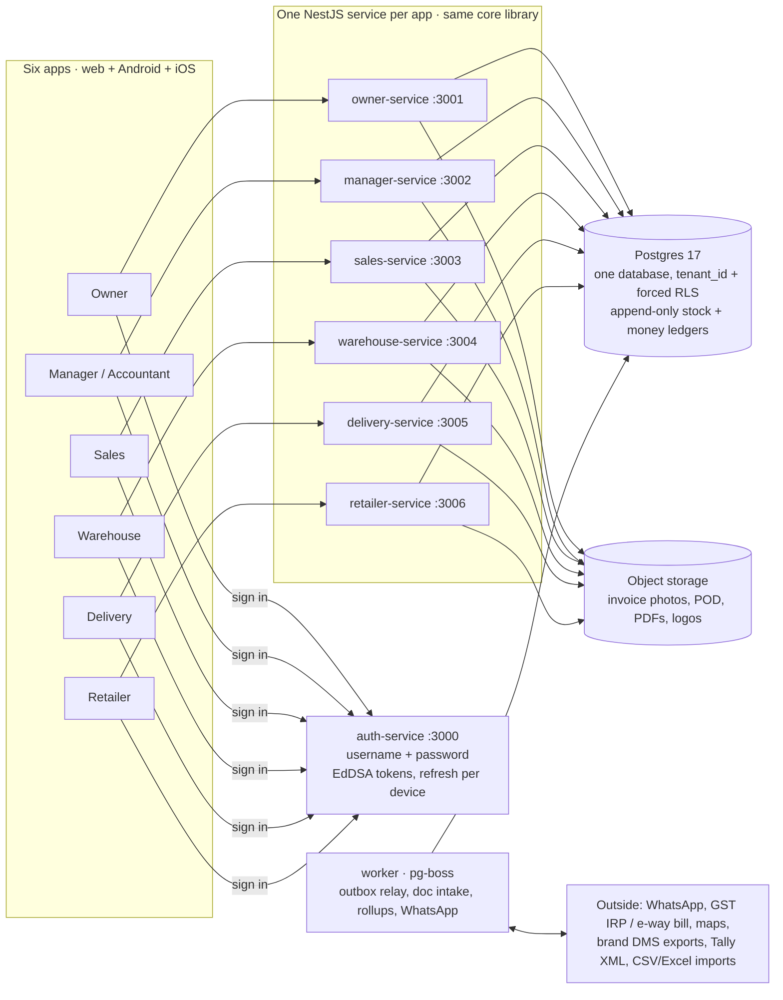
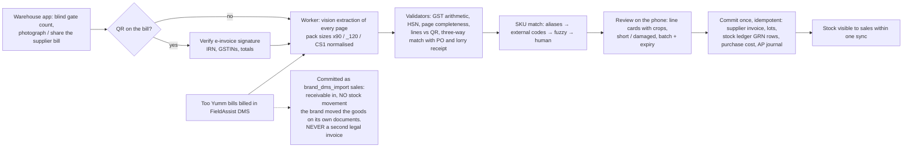
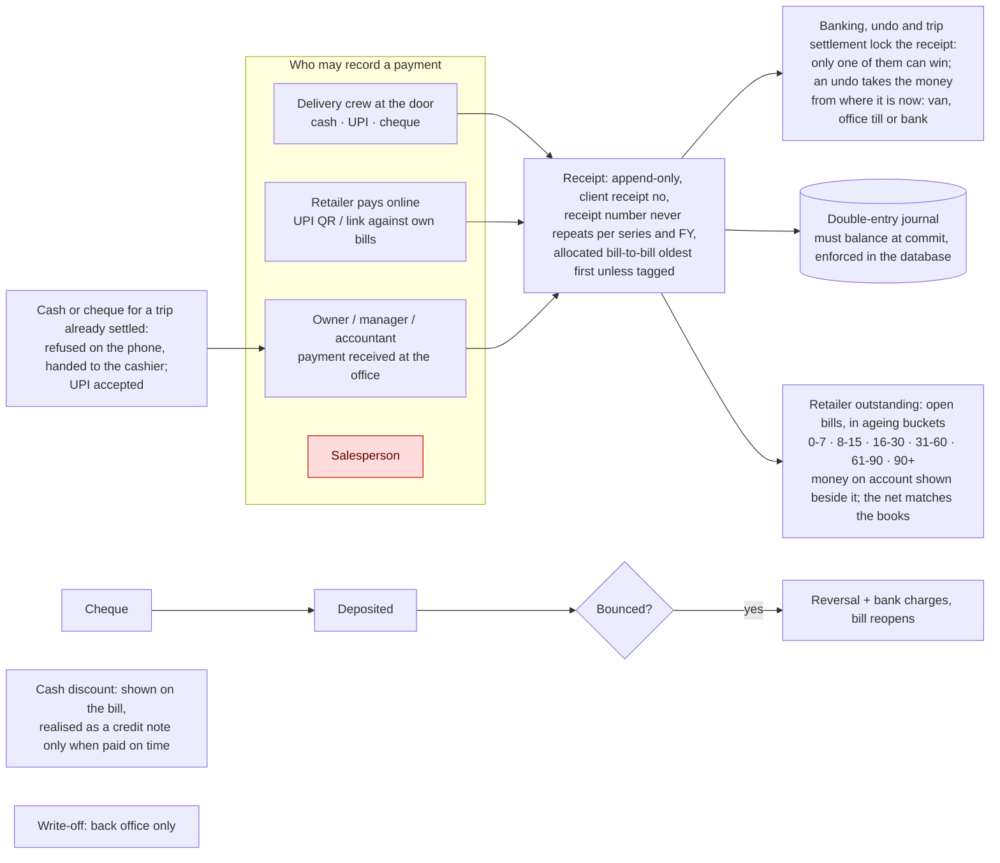
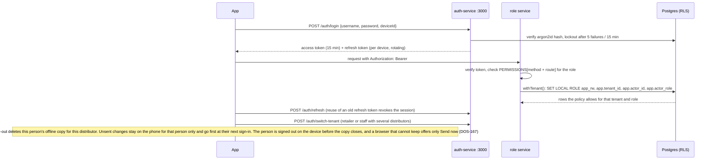

# Distribution OS — single source of truth

**What this file is.** The one document that survives everything: context compression in Claude sessions, laptop sleeps, model
switches, a new developer. It holds the product's _shape_ (who uses which app, how work and money flow between the apps, the rules
that can never be broken) and the _founder's decisions_, each dated. It is short on purpose, so it is read in full at the start of
every session. Where it points to another document, that document holds the detail; where it states a rule, this file wins.

**How it is kept true.**

1. Any founder decision, correction or new requirement is written into this file **in the same turn it is given** (the decisions
   register in §8 and, if a flow changed, the diagram it changed). The build status is _not_ kept here: that lives in
   `docs/18-build-log.md` and changes every hour; this file changes only when the product changes.
2. Every session reads this file first, before `docs/18-build-log.md` (`CLAUDE.md` says so).
3. Diagrams are Mermaid text, so they diff in git, render on GitHub
   (https://github.com/prajwalchavan/Distribution-OS/blob/main/docs/22-source-of-truth.md) and in the Claude desktop app, and can be
   edited without a drawing tool. `docs/design/five-apps-flow-atlas.html` was the earlier, five-app illustrated version; it is kept
   as history and is superseded by this file wherever the two disagree.
4. The change log in §11 records every edit with its date and source (founder message, review, build).

---

## 1. The product in five lines

Distribution OS is a multi-tenant SaaS for Indian FMCG distributors (manufacturer → **distributor** → retailer), sold by subscription
to the distributor. One distributor is one **tenant**; every rupee and every piece of stock is recorded in append-only ledgers under
that tenant. Six apps, one per role, each talking to its own backend service, all on one Postgres database with row-level security.
The pilot customer is **Tarsun Enterprises, Kalyan West** (Too Yumm on FieldAssist DMS, Campa, MOM makhana; ~36 shops in the demo
data). Solo founder; built for lakhs of users from day one; local database with dummy data first, deployment later.

## 2. People, apps and services

Founder decision (2026-09-04): **every role gets its own app**; the manager and the accountant share one. Each app has its own backend
service so a role can only reach the endpoints its service mounts; the permission matrix then decides per endpoint inside that.

**As built (2026-09-21, docs/31): the six business apps are ONE INSTALL, `frontend/dos-app`.** Each role keeps its own screens, its own
service and its own permissions — what changed is that they are six visible ROUTE GROUPS of one Expo project (`/owner/orders`,
`/delivery/stop/[id]/collect`) rather than six installs. The elected role in the access token (§7) decides which group opens and which
service every call leaves for; a person whose membership permits more than one role picks at **Continue as …** after the password. The
server is untouched: still one service per role. The platform console stays a separate app, because its staff hold no membership.

| #   | App (package)                        | Who signs in                              | Device                            | Service : port             | What they do there                                                                                                                          |
| --- | ------------------------------------ | ----------------------------------------- | --------------------------------- | -------------------------- | ------------------------------------------------------------------------------------------------------------------------------------------- |
| 1   | Owner (`dos-app`, `/owner`)          | `owner`                                   | Web + Android + iOS (one code)    | `owner-service` : 3001     | Day numbers **with graphs** (growth, performance), approvals, live map, prices, schemes, credit, settings, **own branding**, imports        |
| 2   | Manager (`dos-app`, `/manager`)      | `manager`, `accountant`                   | Web + Android + iOS (one code)    | `manager-service` : 3002   | Order queue, GRN review, billing desk, day-end, registers, Tally export (accountant: read + exports)                                        |
| 3   | Sales (`dos-app`, `/sales`)          | `salesperson`                             | Web + Android + iOS; offline      | `sales-service` : 3003     | Beat, shop check-in, order entry, bargain request, visits, own targets. **Never sees cost, never collects money**                           |
| 4   | Warehouse (`dos-app`, `/warehouse`)  | `warehouse`                               | Web + Android + iOS (one code)    | `warehouse-service` : 3004 | Gate count, scan supplier bills, pick, pack (invoice is issued here), load sheets, challans                                                 |
| 5   | Delivery (`dos-app`, `/delivery`)    | `delivery`                                | Web + Android + iOS; offline, GPS | `delivery-service` : 3005  | Trip, stops, proof of delivery, returns, **collect cash / UPI / cheque**, van sales, settlement                                             |
| 6   | Retailer (`dos-app`, `/retailer`)    | `retailer` (one login, many distributors) | Web + Android + iOS; online only  | `retailer-service` : 3006  | See bills and outstanding, reorder, **pay online**, track delivery; one card per linked distributor                                         |
| 7   | Admin (`frontend/admin-app`)         | `platform_admin` (Distribution OS staff)  | Web + Android + iOS (one code)    | `admin-service` : 3007     | Onboard distributors, plans and subscription state, support-access grants (time-boxed, owner-approved, audited). v1 per founder 2026-09-05. |
| —   | Sign-in for all six                  | every role                                | —                                 | `auth-service` : 3000      | Username + password, our own tokens; switch distributor for users with more than one membership                                             |
| —   | Worker (`backend/worker`)            | system                                    | —                                 | pg-boss                    | Outbox relay, retention, document intake jobs, rollups, notifications                                                                       |

Rows 1-6 are the six route groups of one app (`frontend/dos-app`, one web port **5173**, one Android build, one iOS build); row 7 is a
separate install (`frontend/admin-app`, 5179). The per-role web ports 5174-5178 are released.

Every service has `/health`, `/swagger`, `/docs` and `/docs/openapi.json`. All demo passwords are `Dos@1234`; usernames are in
`docs/18-build-log.md`.

## 3. System map

Rules that shape the map: a service serves only its roles (any other role gets 403 before business logic); every endpoint has a row in
the permission matrix (`backend/libs/contracts/src/permissions.ts`) and the guard fails closed on an undeclared route; every service is
stateless and can run as many copies as needed; the database is the only shared state.

## 4. The loop every order travels (order to cash)

```mermaid
flowchart TB
  subgraph S [Sales app · salesperson]
    S1[Beat for today] --> S2[Check in at the shop<br/>geo-tag as evidence, never a block]
    S2 --> S3[Order: reorder last / suggested / grid<br/>cases + pieces, live ATP hint]
    S3 --> S4{Price engine + credit check<br/>on the device}
    S4 -- inside limits, or over the limit on a warn shop --> S5[Submit → submitted<br/>a warn shop over its limit confirms<br/>with a credit notice the desk sees]
    S4 -- bargain, or over the limit on a strict or stop shop --> S6[Approval request]
  end
  subgraph R [Retailer app · shop]
    R1[Reorder / free-text on WhatsApp] --> S5
  end
  subgraph O [Owner app]
    S6 --> O1[Approve / reject<br/>price variance, credit, MOV, bargain<br/>a credit approval lets only this order through;<br/>the shop credit limit stays as set]
  end
  O1 --> C[Server re-prices at the same version,<br/>reserves stock → confirmed]
  S5 --> C
  subgraph W [Warehouse app]
    C --> W1[Fulfilment queue by beat / trip]
    W1 --> W2[Picklist consolidated by SKU, FEFO lots<br/>batches under the minimum shelf life, 30 days by default,<br/>go last; picking one warns, never blocks] --> W3[Pick actual lots → picking]
    W3 --> W4[Pack per order → packed<br/>short-packs are pack rows, never order edits]
    W4 --> W5[GST invoice issued at pack<br/>tenant series, own name and logo, UPI QR<br/>packed goods leave the godown here, once]
    W5 --> TP[Trip planned: W10 godown / M7 desk,<br/>bills from the planning board]
    TP --> W6[Load sheet built for the trip, approved by the manager<br/>+ delivery challan, crew count confirmed by PIN<br/>the packed lots move dock → vehicle,<br/>free van stock godown → vehicle]
  end
  subgraph T [Departure · owner, manager or delivery crew]
    W6 --> T1[Trip departs → orders dispatched<br/>never while the load sheet is a draft,<br/>never with a bill no load sheet counted out;<br/>the warehouse role cannot depart a trip]
  end
  subgraph D [Delivery app · crew]
    T1 --> D1[Trip: next stop, maps hand-off<br/>the stop shows overdue dues; a credit-stopped shop:<br/>take the money first, the goods still go]
    D1 --> D2{At the door}
    D2 -- all --> D3[Delivered + proof of delivery]
    D2 -- part --> D4[Partial: per-line qty, reason → credit note]
    D2 -- none --> D5[Failed: reason, stock stays on vehicle<br/>the bill waits on the van until check-in,<br/>then goes back to planning for a new load sheet]
    D3 & D4 --> D6[Collect: cash / UPI with UTR / cheque<br/>receipt allocated oldest bill first]
    D1 --> D7[Van sale from vehicle stock<br/>normal invoice series]
    D6 --> D8[Check-in: unsold stock counted back,<br/>not while the phone still holds unsent payments;<br/>settlement counts every trip payment however it arrived,<br/>variance needs owner]
  end
  subgraph M [Manager app · desk]
    D8 --> M1[Day-end: registers, bank deposits,<br/>cheques, brand-DMS bills captured]
  end
  D6 --> RX[Retailer gets invoice, POD, receipt on WhatsApp;<br/>can also pay online in the retailer app]
```

The three state machines behind this loop are the code in `backend/libs/domain/src/state-machines/` and the apps never set a state
column by hand:

- **Order**: draft → submitted → confirmed → picking → packed → dispatched → delivered | partially_delivered → closed. Cancel: a shop while draft or submitted, a rep up to confirmed, the desk (owner, manager) up to picking, with the picker told which lines to put back; a packed order only through its bill; after dispatch only a credit note (QA DOS-138). `return_undelivered` sends dispatched back to packed.
- **Trip**: planned → loading → active → closing → settled | settled_with_variance; **stop**: pending → started → arrived → delivered |
  partial | failed.
- **Invoice**: draft → issued → partially_paid → paid; issued may be written_off or cancelled (before dispatch and before any money);
  once money lands the only correction is a credit note. "Overdue" is computed, never stored. Cancelling a bill before dispatch
  cancels its order in the same step — the order keeps its number and its history, nothing is left to bill or to load, and the
  shop that still wants the goods gets a fresh order (QA DOS-139).

## 5. Stock in: supplier bill to goods received (zero typing except the gate count)

Purchase cost lands in `tenant_product_costs`, which only owner, manager, accountant and system can read. That is a database rule with
tests, not an app rule.

Goods from a supplier come in only on a goods receipt. By hand, only the owner or a manager adds stock or posts opening stock; the
warehouse login only takes stock off (damaged, expired, a correction, a count found short), and more on the rack than the books show is
a cycle count the desk posts (QA DOS-044). The accountant reads stock, supplier bills, goods receipts and inbound documents and changes
none of them; photographing a bill is unchanged (QA DOS-037).

## 6. Money: who may touch it and where it goes

Founder rule (2026-09-04): **the salesperson never collects money** — the sales service has no receipt endpoint and the matrix never
grants one. Cash on a vehicle counts toward expected cash at settlement; variance beyond the owner's tolerance blocks trip close. Cash and cheques from a trip reach the bank only after that trip settles (QA DOS-132, 2026-09-13). Day-end counts every payment of a trip however it reached the office, online or from a phone that had no signal, net of any undone; a cash or cheque payment that reaches the office after its trip settled is refused and handed to the cashier, a UPI one is accepted; the phone cannot check the vehicle in while it still holds unsent payments (QA DOS-168, DOS-169, DOS-170, 2026-09-14).

## 7. Sign-in and permissions

**Platform console levels (founder, 2026-09-12).** The console's token role is always `platform_admin`; its level narrows what it may do,
and the server enforces it on every console action: **super** does everything (onboard, suspend and reactivate, plans, lock and unlock
logins, support access); **support** reads everything and may only ask for and hand back support access to a distributor; **billing**
reads everything and may only change a distributor's plan.

**Order changes (founder, 2026-09-13, QA DOS-115).** Warehouse, delivery and accountant logins cannot create (including repeat last
order), re-line, submit or cancel an order, online or by device upload; they still read orders. **Offline uploads (founder, 2026-09-13, QA DOS-166).** `/sync/upload` checks every operation against the same
permission matrix, so the offline route can never do what the normal endpoint refuses. **Stock and supplier bills (founder,
2026-09-13, QA DOS-037, DOS-044).** Only the owner and the manager add stock or record opening stock; the accountant views supplier bills,
goods receipts and stock without changing them.

OTP (SMS / WhatsApp) is a **later enhancement layered on top** of username + password, not a replacement. Distribution OS branding
appears only on the sign-in screen; inside every app and on every printed document the distributor sees their **own** name and logo.

## 8. Founder decisions register (dated; newest last)

| Date       | Decision                                                                                                                                                                                                                                                                                                                                                                                                                                                                                                                                                                                                                                                                                                                                                                                                                                      | Where it is enforced / detailed                                                                                                                                                |
| ---------- | --------------------------------------------------------------------------------------------------------------------------------------------------------------------------------------------------------------------------------------------------------------------------------------------------------------------------------------------------------------------------------------------------------------------------------------------------------------------------------------------------------------------------------------------------------------------------------------------------------------------------------------------------------------------------------------------------------------------------------------------------------------------------------------------------------------------------------------------- | ------------------------------------------------------------------------------------------------------------------------------------------------------------------------------ |
| 2026-08    | TypeScript everywhere; van sales allowed (vehicle is a stock location); GPS tracking of delivery staff; iOS + Android; revenue = distributor subscription; no fintech                                                                                                                                                                                                                                                                                                                                                                                                                                                                                                                                                                                                                                                                         | docs/15 F-series, ADR 0013                                                                                                                                                     |
| 2026-08    | Tarsun bills from TradeEzee (Windows ERP); Too Yumm runs on FieldAssist DMS; coexist by import, never a second legal invoice                                                                                                                                                                                                                                                                                                                                                                                                                                                                                                                                                                                                                                                                                                                  | docs/15 F4–F5, ADR 0014, docs/05                                                                                                                                               |
| 2026-09-04 | Repo root holds only `backend/`, `frontend/`, `docs/`, `CLAUDE.md`; every service and app an independent package                                                                                                                                                                                                                                                                                                                                                                                                                                                                                                                                                                                                                                                                                                                              | docs/19                                                                                                                                                                        |
| 2026-09-04 | **Six apps, one per role**; manager and accountant share; each app on its own backend service; one Postgres database the founder views in DBeaver                                                                                                                                                                                                                                                                                                                                                                                                                                                                                                                                                                                                                                                                                             | §2 above, docs/19, docs/21                                                                                                                                                     |
| 2026-09-04 | **Username + password**, our own token service, no third party; OTP and resend-OTP are a future enhancement                                                                                                                                                                                                                                                                                                                                                                                                                                                                                                                                                                                                                                                                                                                                   | auth module, §7                                                                                                                                                                |
| 2026-09-04 | **Permission matrix**: which role may call which endpoint, tested for every endpoint × every role                                                                                                                                                                                                                                                                                                                                                                                                                                                                                                                                                                                                                                                                                                                                             | `permissions.ts`, `describePermissionMatrix`                                                                                                                                   |
| 2026-09-04 | **Backend first, production grade on the local database**; every endpoint of every service built and tested; then the six apps one at a time                                                                                                                                                                                                                                                                                                                                                                                                                                                                                                                                                                                                                                                                                                  | CLAUDE.md, docs/18                                                                                                                                                             |
| 2026-09-04 | Swagger on every service with **sample payloads that actually work** (built from demo rows, not placeholders)                                                                                                                                                                                                                                                                                                                                                                                                                                                                                                                                                                                                                                                                                                                                 | `/swagger`, `pnpm smoke`                                                                                                                                                       |
| 2026-09-04 | Owner app must have **graphs** wherever possible: growth, how the distributorship is performing                                                                                                                                                                                                                                                                                                                                                                                                                                                                                                                                                                                                                                                                                                                                               | reporting module serves chart-ready series                                                                                                                                     |
| 2026-09-04 | UI: Claude proposes the design system, founder reviews; modern look per current standards; **English only** for now; **online-first now, offline for sales + delivery before the pilot**; **Android and iOS**; haptics and "feel good"                                                                                                                                                                                                                                                                                                                                                                                                                                                                                                                                                                                                        | docs/design/UX-00…03                                                                                                                                                           |
| 2026-09-04 | **3–4 layout mockups as images before any frontend code**; founder picks one letter for all six apps, **after the backend is complete**                                                                                                                                                                                                                                                                                                                                                                                                                                                                                                                                                                                                                                                                                                       | artifact link in docs/18; A Ledger / B Instrument / C Panel / D Signal                                                                                                         |
| 2026-09-04 | Invoice series: per-tenant configuration, never hard-coded (cut-over series undecided)                                                                                                                                                                                                                                                                                                                                                                                                                                                                                                                                                                                                                                                                                                                                                        | docs/17 §D1, `numbering_series`                                                                                                                                                |
| 2026-09-04 | Cash discount: not important now; realised at receipt only                                                                                                                                                                                                                                                                                                                                                                                                                                                                                                                                                                                                                                                                                                                                                                                    | docs/17 §D2                                                                                                                                                                    |
| 2026-09-04 | Shops **are** GST-registered: B2B tax invoice is the primary document; B2C path kept for shops without GSTIN                                                                                                                                                                                                                                                                                                                                                                                                                                                                                                                                                                                                                                                                                                                                  | docs/17 §D3                                                                                                                                                                    |
| 2026-09-04 | **Only delivery collects money, or the shop pays online; the salesperson never does**; desk may record office payments                                                                                                                                                                                                                                                                                                                                                                                                                                                                                                                                                                                                                                                                                                                        | docs/17 §D4, §6 above                                                                                                                                                          |
| 2026-09-04 | No van-sale numbering: van sales use the normal invoice series                                                                                                                                                                                                                                                                                                                                                                                                                                                                                                                                                                                                                                                                                                                                                                                | docs/17 §D5                                                                                                                                                                    |
| 2026-09-04 | **No brand exists: create one.** Product is **white-labelled**: each distributor sees their own name and logo in the owner app and on every document                                                                                                                                                                                                                                                                                                                                                                                                                                                                                                                                                                                                                                                                                          | docs/17 §D6, `tenant_settings` branding keys                                                                                                                                   |
| 2026-09-04 | Data migration is a **generic importer** (upload → preview → map columns → save profile → dry run → commit) for any source: TradeEzee, Marg, Busy, Tally, FieldAssist, Excel                                                                                                                                                                                                                                                                                                                                                                                                                                                                                                                                                                                                                                                                  | docs/17 §D7, integrations plan                                                                                                                                                 |
| 2026-09-04 | Demo data must cover **three distributors, staff under each, shops linked to more than one distributor**                                                                                                                                                                                                                                                                                                                                                                                                                                                                                                                                                                                                                                                                                                                                      | CLAUDE.md, chain step 11                                                                                                                                                       |
| 2026-09-05 | **Keep developing until a hard blocker**; never stop between backend modules; verify, record, launch next in the same turn                                                                                                                                                                                                                                                                                                                                                                                                                                                                                                                                                                                                                                                                                                                    | CLAUDE.md session protocol, docs/18                                                                                                                                            |
| 2026-09-05 | Commit at module boundaries with a message stating what is complete and what is in progress                                                                                                                                                                                                                                                                                                                                                                                                                                                                                                                                                                                                                                                                                                                                                   | git history                                                                                                                                                                    |
| 2026-09-05 | This file is the single source of truth; updated in the same turn as any founder decision                                                                                                                                                                                                                                                                                                                                                                                                                                                                                                                                                                                                                                                                                                                                                     | §0 rules, CLAUDE.md                                                                                                                                                            |
| 2026-09-05 | **Layout chosen: A Ledger** (of A Ledger / B Instrument / C Panel / D Signal). Applies to all six apps; design system finalised on it.                                                                                                                                                                                                                                                                                                                                                                                                                                                                                                                                                                                                                                                                                                        | docs/design/UX-00-design-system.md, layout artifact                                                                                                                            |
| 2026-09-05 | **Accountant scope = money desk + reads**: may record office receipts, deposits, cheque bounces, write-offs; reads and exports everything; NO prices, schemes, credit limits, approvals or settings.                                                                                                                                                                                                                                                                                                                                                                                                                                                                                                                                                                                                                                          | `permissions.ts` (ACCOUNTANT narrowed), docs/23                                                                                                                                |
| 2026-09-05 | **Manager PIN for load-out is given in the MANAGER app** (manager approves the load sheet from their own phone or desk; the warehouse device waits for it), not typed on the warehouse phone.                                                                                                                                                                                                                                                                                                                                                                                                                                                                                                                                                                                                                                                 | warehouse `loadSheets.confirm` + manager approval, docs/23                                                                                                                     |
| 2026-09-05 | docs/23 screen inventory is binding: the retailer app must be able to PLACE orders (`orders.submit` for the retailer role); the salesperson may SEE a shop's outstanding and credit check (never collect); owner Settings needs branding/numbering/settings endpoints; owner graphs need `reporting.series`.                                                                                                                                                                                                                                                                                                                                                                                                                                                                                                                                  | docs/23, platform-gaps slice in the chain                                                                                                                                      |
| 2026-09-05 | Design system finalised on A Ledger (`docs/design/UX-00-design-system.md`, adversarially reviewed: 17 findings fixed). Brand name still to pick: **Vitran** (recommended) / Bahi / Distribution OS.                                                                                                                                                                                                                                                                                                                                                                                                                                                                                                                                                                                                                                           | UX-00 §3.6, §9, §10                                                                                                                                                            |
| 2026-09-05 | **Product name: Distribution OS.** App names: "Distribution OS - Owner", "Distribution OS - Manager", "Distribution OS - Sales", "Distribution OS - Warehouse", "Distribution OS - Delivery", "Distribution OS - Retailer" (store listing, app icon label, sign-in screen). Inside the apps the distributor's own name shows (white-label).                                                                                                                                                                                                                                                                                                                                                                                                                                                                                                   | UX-00 §10 brand, app packages                                                                                                                                                  |
| 2026-09-05 | **Branches: one tenant = one distributorship** for pilot and v1. Multi-branch is v2: each branch its own tenant plus an owner group view.                                                                                                                                                                                                                                                                                                                                                                                                                                                                                                                                                                                                                                                                                                     | schema (no branch entity), Confluence Personas                                                                                                                                 |
| 2026-09-05 | **AI features are ALL in v1 (before pilot)**: WhatsApp free-text → draft order (LLM parse against the shop's own SKU history, always human-confirmed), voice order capture (speech → same parser), demand forecasting / reorder suggestions for purchase planning, and route optimisation (stop sequencing by distance and time windows, driver may override). This overrides docs/03 "must not build" for routing and the post-pilot deferral.                                                                                                                                                                                                                                                                                                                                                                                               | new module 12 `ai` (intake parsing, voice, forecasting, routing) in the chain                                                                                                  |
| 2026-09-05 | **Positioning stays multi-industry** (FMCG first; pharma, electricals, dairy, agri as markets) while the product remains FMCG-shaped until a second-industry customer appears.                                                                                                                                                                                                                                                                                                                                                                                                                                                                                                                                                                                                                                                                | Confluence Vision / Target Market                                                                                                                                              |
| 2026-09-05 | **Platform console in v1**: a seventh app + service "Distribution OS - Admin" for organisation onboarding, plans and subscription state, support-access grants (time-boxed, owner-approved, audited). Revenue stays subscription; no fintech. **Built 2026-09-06 in the shape below** — `platform_admin` is NOT a membership role and has its own sign-in (`/auth/platform/login`); the console ASKS for support access and only the distributor's own OWNER opens the window (`tenancy.support.approve`); an approved window becomes a five-minute signed `x-support-grant` pass that acts as that owner, GET-only while the scope is read-only, and writes one `platform_audit` row per call; the console reads COUNTS of a distributor's size and never a rupee of its trade; suspending a distributorship refuses every sign-in with 423. | module 13 `platform-admin` (admin-service :3007, admin-app); `libs/core/src/modules/platform-admin/**`, `platform/support-access.ts`, migrations 0033/0034/0035–0037/0039/0042 |
| 2026-09-05 | Confluence space is rewritten from this file (PM/TPM voice); docs/22 stays the source of truth, Confluence mirrors it.                                                                                                                                                                                                                                                                                                                                                                                                                                                                                                                                                                                                                                                                                                                        | docs/24 audit, Confluence pages                                                                                                                                                |
| 2026-09-05 | Founder wants to SEE any frontend under development in the browser as it is built (web build of each app via the Browser pane / launch.json).                                                                                                                                                                                                                                                                                                                                                                                                                                                                                                                                                                                                                                                                                                 | frontend workflow: every app slice ends with a browser check and a screenshot to the founder                                                                                   |
| 2026-09-05 | **Deployment, least cost, no funding (docs/26, all six confirmed): dev stays on the founder's Mac (cloud only for test and prod); Postgres self-managed in a container on the VM until ~10 paying tenants, then RDS; an all-in-one process mode (seven services + worker in one container) is built for small deployments, split later; offline sync is OUR OWN delta sync (no PowerSync; docs/07 superseded on that point); Android first for the pilot, iOS after; Lightsail Mumbai as the starting compute, the docs/11 shape (Fargate, ALB, RDS) only with revenue.**                                                                                                                                                                                                                                                                     |
| 2026-09-05 | **Cost stages (docs/26 §4): stage 0 = first run at ₹0 (free credits, sideloaded APK, stub drivers); stage 1 = 1–10 clients at minimum spend (~$40/mo); stage 2 = thousands, spend to scale. The architecture must carry stage 2 from day one (stateless services, RLS multi-tenancy, replica, S3, expand-only migrations); only the infrastructure under it changes.**                                                                                                                                                                                                                                                                                                                                                                                                                                                                        |
| 2026-09-05 | **Typeface: IBM Plex Sans** for all seven apps (tabular digits at every weight, ₹ glyph, Devanagari sibling with the same digit advance for when Hindi arrives). The last open design token is closed.                                                                                                                                                                                                                                                                                                                                                                                                                                                                                                                                                                                                                                        |
| 2026-09-05 | **Languages: English only for the pilot.** Hindi (and Marathi if the market asks) comes before the second customer. The strings module keeps its locale structure from day one so adding a language is a translation job, never a rewrite.                                                                                                                                                                                                                                                                                                                                                                                                                                                                                                                                                                                                    |
| 2026-09-05 | **AI keys: stub drivers for now.** docint and the `ai` module run on the deterministic engine; `ANTHROPIC_API_KEY` is added to `backend/.env` whenever the founder wants a real bill photo read. Nothing in the build waits on it.                                                                                                                                                                                                                                                                                                                                                                                                                                                                                                                                                                                                            |
| 2026-09-07 | **Every finished app is pushed, not just committed.** The moment an app's gate is green and the build log is updated, the snapshot is committed AND `git push origin main` runs; the same for the backend, which is already fully pushed. The founder wants the remote to always hold every completed piece, so a dead laptop costs nothing.                                                                                                                                                                                                                                                                                                                                                                                                                                                                                                  | frontend chain: commit + push per app slice; CLAUDE.md session protocol                                                                                                        |
| 2026-09-07 | **FRONTEND COMPLETE: all seven apps built and gated green** — owner, manager (accountant on it), sales, warehouse, delivery, retailer and admin, each one Expo codebase serving website + Android + iOS, each verified by an independent gate that walked every screen at desk and phone widths against the live services and the pilot database.                                                                                                                                                                                                                                                                                                                                                                                                                                                                                             | `frontend/<role>-app`; docs/18 status table; `docs/28-running-it-locally.md`                                                                                                   |
| 2026-09-07 | **Fable runs the end-to-end test.** The chain's own F10 end-to-end gate was stopped after the seventh app went green; the founder will drive E2E from a Fable session instead, as the architect role already defines. Nobody re-launches that gate unasked.                                                                                                                                                                                                                                                                                                                                                                                                                                                                                                                                                                                   | `scratchpad/dos-frontend.js` F10 stopped; E2E opens the next session                                                                                                           |
| 2026-09-12 | **QA batch 1 approved.** The 4 P0 and the 30 P1 findings on the order-to-cash chain (QA/findings/09-phase-1-approval-gate.md) are fixed before the cross-role end-to-end phase; the other P1, P2 and P3 wait for the QA backlog. Every subagent runs on Opus; Fable reviews only contract, permission and schema changes, and says when to switch.                                                                                                                                                                                                                                                                                                                                                                                                                                                                                            |
| 2026-09-12 | **Console levels are enforced (QA DOS-106).** super: everything. support: read everything, ask for and hand back support access, nothing else. billing: read everything, change a distributor's plan, nothing else. Only super onboards, suspends, reactivates, locks or unlocks.                                                                                                                                                                                                                                                                                                                                                                                                                                                                                                                                                             |
| 2026-09-12 | **Only the owner, the manager and the delivery crew send a trip out (QA DOS-043).** The warehouse role keeps creating trips, adding stops and starting loading, but can no longer depart a trip, and no trip departs while its load sheet is still a draft.                                                                                                                                                                                                                                                                                                                                                                                                                                                                                                                                                                                   |
| 2026-09-12 | **"Send statement" sends a short text now (QA DOS-007).** A WhatsApp/SMS summary with the balance, the overdue amount and a UPI pay link; the PDF statement comes later.                                                                                                                                                                                                                                                                                                                                                                                                                                                                                                                                                                                                                                                                      |
| 2026-09-12 | **An offline doorstep delivery carries its proof photo inside the queued operation (QA DOS-056).** The photo uploads with the delivery when the network returns; the separate photo staging queue of docs/27 §15 is not built, and docs/27 §15 is updated with the fix.                                                                                                                                                                                                                                                                                                                                                                                                                                                                                                                                                                       |
| 2026-09-12 | **Receipt numbers never repeat (QA DOS-032, DOS-059).** Unique per distributor, series and financial year, enforced by the database; a collision is refused (409 online, a sync rejection offline). The QA database `dos_qa` is rebuilt from the fixed seed once this lands; the founder's own `dos` database is the founder's call.                                                                                                                                                                                                                                                                                                                                                                                                                                                                                                          |
| 2026-09-13 | **QA batch 2 approved: every open finding is fixed.** Founder: "I want to fix everything identified" · "Approved all pending items". Every P0, P1, P2 and P3 finding from the Phase 1 walkthroughs and the batch-1 regression, worked P0 → P1 → P2 → P3. A fix that changes a contract, permission or schema shape without an architect design goes to the architect (Fable) first; the rest are built on Opus, test-first with an independent verifier. |
| 2026-09-13 | **Warehouse and delivery logins cannot create, re-line, submit or cancel an order (QA DOS-115).** Those four order actions leave the warehouse and delivery roles in the permission matrix; both roles still read orders. |
| 2026-09-13 | **Correction to the 2026-09-12 receipt-number row (architect, QA DOS-032, DOS-059).** A receipt number the server assigns that collides is repaired in the same transaction (counter moved past the highest number used, one retry, an audit row), so a lagging counter never stops money recording; a 409 or a sync rejection is only for a number a client supplied itself. The financial year used for numbering is IST everywhere. |
| 2026-09-13 | **Cash still out with a delivery crew is banked only after its trip settles (QA DOS-132).** The Day-end bank register leaves out trip receipts whose trip has not settled, and the server refuses to deposit them. |
| 2026-09-13 | **A damaged or expired return never goes back into saleable stock, at the desk or at the door (QA DOS-116).** A credit note for damaged or expired goods puts its pieces in the damaged bin; marking such a line saleable is refused, the same rule as the doorstep return. |
| 2026-09-13 | **Fable's weekly budget is used in full, as helper agents.** From the Opus session, Fable signs off every fix plan before it is built, designs what needs a decision, reviews each lane before it merges into main, and judges the end-to-end business test. Planners, builders, verifiers and app walkers stay on Opus; no session switch is needed for that work. This replaces the 2026-09-12 rule that every helper agent runs on Opus. |
| 2026-09-13 | **P2 and P3 fixes are built in lean mode.** P0 and P1 keep the full process (plan, review, Fable sign-off, build, verify). P2 and P3 are grouped by app: one builder and one verifier per group of five to eight, no separate planning step; copy-only or layout-only P3 fixes may run on Sonnet; Fable designs the ones that need a decision. One full regression (web, Android, iOS) runs at the end of QA batch 2, and phones are walked only where a fix changes a phone screen. If overall weekly usage passes about 70% by Wednesday, work stops after P0/P1 and its regression, and P2/P3 resume after the Saturday reset. |
| 2026-09-13 | **Every offline upload is checked against the permission matrix (QA DOS-166).** A role that may not make a change through the normal endpoint cannot make it through /sync/upload either; the upload refuses it as a recorded sync rejection, never silently. A salesperson can never record a receipt by any route. Added to QA batch 2 as a P0. |
| 2026-09-13 | **Architect defaults in QA batch 2, approved by the founder.** (1) The accountant cannot create, re-line, submit or cancel an order (DOS-115; follows the 2026-09-05 accountant scope). (2) Confirming a held order applies the rates approved since it was drafted, including a shop's own approved rate, and nothing else: a price-list or scheme edit made in between does not re-price it (DOS-126). (3) Cheques collected on a trip, like its cash, are banked only after the trip settles (DOS-132). (4) Expired goods returned at the desk are booked as damaged; there is no separate expired reason yet (DOS-116). (5) At trip start an emptied 'Cash handed to you' means a ₹0 float; an untouched field keeps the planned float (DOS-146). (6) In the warehouse app a load sheet is always built for one trip and carries only that trip's bills (DOS-131, DOS-137). |
| 2026-09-13 | **More architect defaults in QA batch 2, approved by the founder.** (1) 'Order again' repeats the shop's last placed order, whoever placed it (rep, shop, phone, WhatsApp, van sale), never a draft (DOS-098). (2) The accountant can view inbound documents, supplier invoices, goods receipts and stock (M3, M4, M16) but cannot book, post or adjust anything there, and can still capture supplier bills (DOS-037). (3) Only the owner and the manager add stock or record opening stock; every other role records a count, and new stock arrives only through a goods receipt (DOS-044). (4) The accountant is not a stock adder (DOS-044). (5) No extra confirmation for large stock reductions yet; it follows the iOS dialog fix (DOS-044, DOS-164). |
| 2026-09-13 | **The offline upload door, as built (architect, QA DOS-166).** `/sync/upload` checks each operation against PERMISSIONS through the procedure its table stands for. A role the matrix refuses gets a recorded `role_not_allowed` rejection before anything is written; a write the database policy refuses is recorded as `not_permitted`, never a 500. The database adds its own line: only the owner, manager, accountant, delivery crew and the system may insert a receipt. Never-list #2 names both. |
| 2026-09-13 | **Clarification of the DOS-115 row (architect).** The five order writes (create, repeat last order, re-line, submit, cancel), online or by device upload, belong to the owner, the manager, the salesperson and the shop. The accountant is outside them too, the architect's default under the 2026-09-05 accountant scope, reversible with one role list. The crew sells from the van only through Van sale. Every role still reads orders; narrowing a driver's reads to his trip's orders is Phase 3. |
| 2026-09-13 | **Trips are planned from a planning board (architect, QA DOS-131, DOS-137).** The godown (W10) and the desk (M7) plan a trip from one board: the crew for the date and the packed bills not yet on a trip; a bill rides on one open trip at most. A load sheet is built for a trip, from the bills on it. §4 shows the step. |
| 2026-09-13 | **Doorstep with no signal, as built (founder-approved exception, QA DOS-056, DOS-156).** Only on the no-signal path does a delivery carry its proof photo inline through `/sync/upload`: a JPEG of at most 300 KB, the route capped at 8 MiB, a single operation over 1 MiB recorded as `row_too_large`. The server stores the photo through the files platform and the row keeps only its key. A phone that gets no answer now says "No connection" (DOS-156). At trip start an emptied cash field is sent as ₹0 and written as the trip's float at depart (DOS-146, default (5) above). |
| 2026-09-13 | **Shop ageing is rebuilt every night for every distributor (architect, QA DOS-117).** The 00:20 IST nightly finalize starts one ageing rebuild per distributor and the worker catches up on start-up, so each morning's ageing buckets are dated today. This is how the planned 00:30 ageing snapshot job is realised; no product rule changes. |
| 2026-09-13 | **Unlocking a login, a precision to the 2026-09-12 console-levels row (architect, QA DOS-107).** Only a super administrator unlocks, with a reason of 1 to 500 characters, audited as `user.enabled`. Unlocking a login that is not locked answers 200 and writes nothing. An unlock restores `users.status` only: the sessions the lock ended stay ended, and memberships, `platform_admins.disabled_at` and the 5-failure password lock are untouched. |
| 2026-09-13 | **Order again and confirm pricing, as built (architect, QA DOS-098, DOS-126).** Order again takes the shop's most recently placed order by placement time, builds the basket on the device and writes nothing until Place order. At confirm a line changes only when a rate approved since the draft lowers its net; this is how §4 "Server re-prices at the same version" is read. Precision to the 2026-09-13 architect-default rows above. |
| 2026-09-13 | **Approving an "Over credit limit" request lets only that one order through (QA DOS-006).** The shop's credit limit stays as it is; the approval screen says so and links to the shop's page, where the limit is changed (audited, as today). |
| 2026-09-13 | **"Outstanding" on the owner's home stays the total of open bills (QA DOS-016).** Money already received on account is shown beside it ("less ₹X on account"), and the Money screen states the net dues, which always match Sundry Debtors in the books. Nothing already stored changes meaning. |
| 2026-09-13 | **Minimum shelf life to ship: one number per distributor, 30 days unless the owner changes it in Settings (QA DOS-054).** Stock reservation and the pick sheet pass over a batch with fewer days left whenever another batch can cover the line; a picker who still takes one gets a red warning the desk can see, but is not stopped (FEFO warns, it never blocks). |
| 2026-09-13 | **The crew hands over goods already billed and loaded even when the shop owes, and the stop tells them (QA DOS-066).** The stop shows the overdue amount, the oldest due date and the days late; a shop on credit mode "stop" also gets a "Credit stopped" chip and "take the money before the goods go in". Nothing blocks the delivery on the phone or the server: the credit check stays at order submit. A "strict" shop gets no chip. |
| 2026-09-13 | **A trip expense of ₹200 or more needs a photo of its bill (QA DOS-071).** ₹200 is the default of a per-distributor setting the owner may change (0 = every expense). The server enforces it for the crew and the desk alike, and the phone says why the button is off. |
| 2026-09-13 | **A "Warn at the limit" shop's order over its credit limit goes through with a credit notice (QA DOS-081).** The rep sees "over the limit, warn only" before placing, and the manager's order list and detail show the notice on the confirmed order. "Strict" and "stop" shops are still held for approval. §4 corrected. |
| 2026-09-13 | **"₹15 off per case on 2+" is ₹15 on every case once two are bought (QA DOS-087).** ₹30 on 2 cases, ₹45 on 3. The price engine gains a per-unit amount reward (per case or per piece, above a threshold, with slabs) and the seeded scheme moves to it; flat "per multiple" schemes keep working as they do. |
| 2026-09-13 | **A shop whose order is held is told in the app only (QA DOS-100).** "We have your order, {distributor} will confirm shortly" is an in-app message, not a paid WhatsApp or SMS. The order screen shows the overdue amount with a Pay button and never a credit limit or credit-available figure (ADR 0006). |
| 2026-09-13 | **A shop that buys from several distributors lands in the one it used last on that device (QA DOS-102).** A fresh install lands in the first. One home shows each distributor's dues, last bill and any van on the way, plus the total owed; there is no "choose your distributor" screen. |
| 2026-09-13 | **A shop sees one office number, set by the owner in Settings, for Call and WhatsApp (QA DOS-103).** With no number set there is no button. "Report a problem / ask for a return" lands in the office's inbound queue with its kind and the bill or delivery it names; the desk triages it and the credit note is raised as today, at the door or by the desk. |
| 2026-09-13 | **The desk may cancel an order while it is being picked (QA DOS-138).** The owner or a manager cancels; the stock hold is released, the picker's sheet shows which lines to put back, and no GST invoice is issued. Reps and shops keep today's limits. A packed order is cancelled only through its bill (DOS-139); after dispatch only a credit note corrects it. §4 corrected. |
| 2026-09-13 | **Sign-out leaves nothing of the previous user or distributor on a device (QA DOS-167, P0).** Added to QA batch 2: on a shared phone or browser the next login saw the previous rep's shops, orders and dues, another distributor's after a restart. Never-list #11. Architect design: QA/evidence/batch2/verdicts/DOS-167-design.md; the founder's answer on unsent changes is the next row. |
| 2026-09-13 | **A device's offline copy belongs to one person in one distributorship, and unsent changes at sign-out stay with that person (founder answer "A", QA DOS-167).** Each person and distributor gets their own copy on the phone or browser, checked before anything is shown and deleted at sign-out; the online cache and the sales order draft follow the same rule. When someone signs out with changes not yet sent, the app says how many, offers "Send now" when there is signal, and "Sign out, keep here": the changes stay on that phone for that person only and go first the next time that person signs in there. Nobody else who signs in can see or send them, and nothing is thrown away at sign-out. A distributor switch keeps both copies. | `@dos/offline` engine (identity stamp checked at open, `end()`, one store per person and distributor), `@dos/api-client` session cache, the sign-out sheet in the sales, delivery and warehouse apps; docs/27 §4, §12, §14 |
| 2026-09-13 | **An order the godown cannot fill confirms SHORT, and the shortfall is recorded on the order (architect enforcement, QA DOS-078; not a new decision).** `stock_shortages` on the order names every line short and by how much, office-only: the desk and the owner read it before pack, the shop's own device never does. It is never a cap on what may be ordered and never a new approval gate — the order still confirms. UX-00 §6.4 and §4 W4 draw it. |
| 2026-09-14 | **Six more findings join QA batch 2 (founder: "Approved").** Two P0: two desks banking the same receipt at the same moment banked it twice (DOS-168), and day-end left out cash a crew took at a door with no signal (DOS-169). Three P1: undoing a trip's cash after day-end took it from the van's money again (DOS-170), the van sale showed the total before GST (DOS-171), and a bill that came back undelivered could never be loaded again properly (DOS-172). One P3: 'left to bill' counted a parked pack twice (DOS-173). Also approved: closing the load-out panel cancels a challan print still waiting (S-108). | QA/findings/12; designs QA/evidence/batch2/verdicts/DOS-168-169-170-design.md, DOS-171-design.md, DOS-172-design.md |
| 2026-09-14 | **Money moves exactly once, and day-end counts every trip payment (QA DOS-168, DOS-169, DOS-170).** Banking, undoing and settling a receipt lock it, so only one of them can win. Day-end counts every payment of the trip however it reached the office, net of any undone. An undo takes the money from where it is now: the van before day-end, the office till after it, the bank once banked. A cash or cheque payment that reaches the office after its trip was settled is refused on the phone, which tells the driver to hand the money to the cashier, who records it at the office; a UPI payment is accepted because the money is already in the account (founder answer A). The driver's phone cannot check the vehicle in while it still holds unsent payments. | receivables and delivery settlement services, delivery app End of day (D8); §6 |
| 2026-09-14 | **No van leaves with a bill nobody counted out (QA DOS-172, founder answer A).** A trip departs only when every bill on it is on a load sheet the godown built, the manager approved and the crew counted, so every van carries a challan and gets the e-way bill check. A bill that comes back undelivered waits on its van until the vehicle is checked in, then returns to the planning board and the loading list and goes out on a fresh load sheet for its next trip. | trips depart gate, load sheets, W7 / W10 / M7; §4 |
| 2026-09-14 | **Money already wrong in the founder's own database is corrected by adding, never editing (founder answer A).** Read-only checks list any receipt banked twice, trip cash missed at a settlement, or an undo taken from the van after day-end; each is corrected by one appended balancing entry, and the founder approves the list trip by trip, including whether the crew handed that cash over or still holds it. The QA database is rebuilt from the demo data instead. | QA data repair after the money fix merges |
| 2026-09-14 | **The van sale shows what the shop pays (QA DOS-171, architect default approved with the batch).** The van-sale screen's headline is the bill total with GST, with before-GST, GST and round-off beneath; after billing it keeps the bill number and amount on screen; the money screen counts a van-sale bill in what is owed at that stop. Items with compensation cess (for example 28% GST plus 12% cess) are completed by DOS-079, which moves up to follow it. | delivery app D6 and D5, vansales service |
| 2026-09-14 | **Sign-out on a shared device, as built (architect rulings 1 and 2 on QA DOS-167).** Each person's offline copy has a short name every browser accepts. A browser that cannot keep an offline copy says so and never offers "Sign out, keep here": the sign-out waits until the changes are sent. An order and its lines are kept whole or not at all. The person is signed out on the device before the device copy closes, so a crash during sign-out can never leave them signed in, and every sign-out button, in the menu and in Settings, takes this path. Web, Android and iOS re-proof running. | @dos/offline, @dos/api-client, the sales, delivery and warehouse leave flow; QA/evidence/batch2/verdicts/DOS-167-ruling-1.json, DOS-167-ruling-2.md, DOS-167-ruling-2-addendum.md |
| 2026-09-19 | **The app never claims work is safe when it is not (founder: "accept all recommended", QA DOS-179, DOS-180).** When a browser or phone cannot keep an offline copy, EVERY screen says so, not just the first one, and the order button stops reading "Saved on this phone" over work that dies with the tab. An order saved with no signal keeps saying so until the office actually confirms it; it never re-labels itself "Order placed" just because the signal came back. Never-list #12. | sales app order screen and connection strip, `@dos/offline` status, `@dos/ui` ConnectionStrip; QA/findings/12 DOS-179, DOS-180 |
| 2026-09-20 | **The list convention applied to the desk lists (QA DOS-009).** Superseded the next day by the architect's ruling of 2026-09-21 below, which states the whole rule in one sentence. Orders sort by server time (`created_at`); bills and trips by the document's own stamped date, which is the column their own window filters on. What was written here as "one stated exception, put to the founder" is not an exception at all under that ruling — it is the same rule read correctly. |
| 2026-09-20 | **A bill cancelled before dispatch takes its order with it (QA DOS-139, architect default).** The bill keeps its number, the stock goes back on the rack, the money is reversed AND the order is cancelled in the same step, with the bill named in its reason. Nothing is left in the billing queue, nothing is offered for loading, and the pack can never be billed again; the shop that still wants the goods gets a fresh order. After dispatch only a credit note corrects a bill. | `billing.invoices.cancel` → `orders.cancelInTx`; `orders.cancel` refuses a packed order and names the route; M6 cancel dialog |
| 2026-09-19 | **Four money and delivery faults found by execution are approved for repair (founder: "fix all 4 defects").** (1) A receipt recorded against a trip that does not exist can never be banked — the trip id is now validated when the receipt is created (DOS-175). (2) Proof of delivery fails with a server error, so a stop cannot be closed (DOS-176). (3) The driver's GPS consent fails with a server error, and no van may depart without it (DOS-177). (4) A late payment the office refuses may be DISCARDED on the phone, erasing the only record that a shop paid — it is kept and routed to the cashier instead, never offered for deletion (DOS-178). Never-list #13. | receivables, delivery (deliveries, consents), delivery app unsent-changes tray; QA/findings/12 |
| 2026-09-19 | **The Q3 repair on the founder's own database is authorised to run (founder: "go on dos").** The method is unchanged from 2026-09-14: read-only checks first, then ONE appended balancing entry per wrong figure, never an edit, with the founder approving the list trip by trip, including whether the crew handed that cash over or still holds it. `pnpm db:migrate` runs on `dos` first, because it has never had the receipts and settlement migrations. | the founder's `dos` database; the money fix merged as `6e5c7c5` |
| 2026-09-19 | **The 70%-by-Wednesday stop rule is withdrawn (founder: "no need of this rule now").** The 2026-09-13 lean-mode row said work would stop after P0/P1 and its regression if weekly usage passed about 70% by Wednesday, with P2/P3 resuming after the Saturday reset. That ceiling no longer applies: QA batch 2 runs through to the end, P2 and P3 included, and the aim is to finish it and its regression **within this week**. Usage is paced rather than capped — the run never sits idle against a limit, and it never stops short of the work. The rest of the lean-mode row (grouping, one builder and one verifier per group, Sonnet for copy-only and layout-only P3, Fable designing what needs a decision, one full regression at the end) stands unchanged. | QA/CHARTER.md, QA/STATE.md, the wave-3 runner |
| 2026-09-19 | **The machine runs unattended, around the clock (founder: "full time internet and charging provided").** Long browser and device walks may run overnight and across sessions; the founder does not need to be present for them. What still serialises them is the Mac's 8 GB of memory — one Android emulator at 3 GB plus Metro plus the eight services is already close to the ceiling — so walks are batched into fewer, longer device sessions rather than one boot per check, and browser walks run alongside a device walk only when the memory allows. | QA/ENV.md, the proof stages of every runner |
| 2026-09-19 | **The Q3 repair found nothing to repair, because the founder's `dos` database holds no real trade (checks executed, read-only, on a copy).** All three distributor books in it — M/s. Tarsun Enterprise, Kalyan Agencies, Sai Distributors — were written by `pnpm db:seed`: all 254 receipts were inserted in one sub-second burst on 2026-09-08 while their printed dates are backdated to 22 Aug – 4 Sep. Every banking check and every settlement check came back clean, and appending balancing entries against invented rows would put false money into the book, which is what the 2026-09-14 ruling exists to prevent. **No entry was appended, and none will be.** The open question is the founder's: has any real collection ever been entered into Distribution OS, or does Tarsun's money still live only in the old books — and if a real book exists anywhere, which one should the repair be re-run against. | QA/evidence/batch2/dos-q3-repair/sign-off-list.md; supersedes the 2026-09-14 "money already wrong in the founder's own database" row as to FACT, not as to method |
| 2026-09-20 (promised 2026-09-19) | **The founder will share a real data extract (founder: "okk share real data extract with you tomorrow").** It answers the question the Q3 repair left open — nothing in `dos` is real trade. What the extract IS decides which job runs: if it is a DISTRIBUTION OS book (a database or dump carrying rows the apps wrote), the money repair re-runs against a copy of it, read-only first, and the founder still signs off trip by trip; if it is an OLD-SYSTEM export (TradeEzee, Tally, Excel), nothing in Distribution OS is wrong and the work is an IMPORT through the generic importer (docs/17 §D7: upload → preview → map columns → save profile → dry run → commit), with the import's own reconciliation. Either way it is copied before it is read and never edited in place. | QA/evidence/batch2/dos-q3-repair/, the integrations importer |
| 2026-09-20 | **DOS-167 is CLOSED — the P0 is met on all three targets, measured (architect judgement 3).** On main `8092048` a person's unsent changes survive sign-out on that device, **go FIRST at that person's next sign-in**, and never reach anybody else. Measured from the service's own front door, zero being the sign-in call: **Android** upload +502 ms before manifest +764 and pull +878, and +539/+702/+813 after a different person had used the phone; **iOS** +356/+582/+605, and +336/+556/+578; **web** +287/+405/+417, and +38 ms after a booted-offline page saw the network. Controls that make those numbers mean something: an EMPTY queue makes no upload at all, and the other person's whole session made ZERO uploads. Each order reached the office exactly once (one `sync_ops` row per op id, no duplicate), the kept ops survived "Sign out, keep here" still queued, and the two people's store files sat side by side on one phone with neither touching the other. A closed P0 is not a finished area: the reconnect-while-signed-in path on phones is still unwired (DOS-184) and several walks remain owed. | `@dos/offline` engine (`drain()` before the handshake on start, reconnect and poll), the leave flow in the sales, delivery and warehouse apps; QA/evidence/batch2/dos-167/close/, verdicts/DOS-167-judge-3.md |
| 2026-09-20 | **A scheme threshold counts every line on the bill, including lines already under an exclusive scheme (QA DOS-075).** "Bills over ₹X" means the bill the shop is actually buying; an exclusive line still earns nothing from the threshold scheme, but it no longer hides the bill's size. Founder: "I agree with all recommendations." |
| 2026-09-20 | **No permanent public link to a shop's papers (QA DOS-057, DOS-099).** Invoices, receipts and statements keep going out as files shared from the phone. A forever-URL carrying a shop's prices and balance is refused; if a link is ever wanted it must expire (7 days) and be signed. Founder: "I agree with all recommendations." |
| 2026-09-20 | **Every list in every app orders by server time, newest first, with the record id only as a tie-break (QA DOS-023).** One convention across the seven apps. Record ids are assigned when a row is typed — which offline is not when the server sees it — so id order makes lists jump after a sync. Founder: "I agree with all recommendations." |
| 2026-09-20 | **A trip may depart before its planned date, and the early departure is recorded (QA DOS-043).** The trip carries the planned date and "departed early" beside it. Refusing an early departure only pushes people to edit the plan, which destroys the record of what was planned. The who-may-depart rule of 2026-09-12 is unchanged. Founder: "I agree with all recommendations." |
| 2026-09-21 | **The smoke gate is worked failure by failure, not as an all-or-nothing bar (founder: "Smoke gate to be done for failed ones").** `pnpm smoke` runs, and every BROKEN it reports is investigated and fixed on its own merits. No lane is held to an absolute "0 BROKEN" before merging, and nobody waits for a perfect run to do anything else. The number that matters is the list of failures and what each one turns out to be. |
| 2026-09-21 | **iOS and Android are validated COMPLETELY at the end, not lane by lane (founder: "IOS and andriod to be validated completely in the end / For now basics can be done").** Until then a device walk covers the basics only — enough to catch something obviously broken — and no finding waits on a phone to close. This supersedes the per-lane "platform proof follows" obligations of 2026-09-14 for everything except a fault a phone alone can show. The complete pass is a block of its own, run once, on both platforms, when the product is otherwise right. It also settles the standing iOS gap: iOS has been the one unproven target since 2026-09-06, and that is now a scheduled piece of work rather than a running debt. |
| 2026-09-21 | **What can be exercised on this Mac comes first (founder: "As working and user tests and all other are more imp that can be done on system it self").** Does it work, and does it work for a real person doing a real job — driven in a browser against the running services on the founder's own machine. That is the priority over device time, and it is what the cross-role end-to-end phase and the full regression are. |
| 2026-09-21 | **The QA programme is cut from thirty days to TEN (founder: "I want you to make it down to 10 days / Remove everything possibly that is unnecessary and keep only required things"), because the Fable subscription has one week left at 2-3 days a week and the work must close this month.** What stays is what can lose money, stock or another tenant's data, plus the proof that the product works end to end for real people: the regression, the cross-role flow, money reconciliation, pricing and GST, inventory, tenant isolation, a compressed business simulation, Android in full with iOS basics, the security slice that public URLs require, and the final audit. What is cut FOR THE PILOT, each with the event that brings it back: performance and search (returns before ~10 paying tenants), accessibility and a hardened public surface (before a public product), observability and DevOps (at go-live), localization and the TradeEzee import (at cut-over), and a larger automated suite (before customer #2). Fable's remaining days are spent on exactly three things: the Stage 2 design, merge reviews of contract/permission/schema changes, and the audit. **Revised the same day on the founder's word "Business simulation is imp": the seven-day business simulation moves from day 7 to days 4-5**, so five days stand behind the test most likely to find something structural instead of three, and the money, pricing, inventory and isolation lanes run AFTER it, aimed at what it exposed. It ends in arithmetic and the arithmetic is the verdict: opening stock + receipts − sales − damage − returns = closing stock per SKU per batch, and revenue = payments + outstanding; any drift is a P0. The plan and the full cut list: `QA/10-DAY-PLAN.md`. |
| 2026-09-21 | **Cut again the same day, from ten days to FIVE (founder: "Possibly cut it down to 4-5 days").** Day 1 the cross-role chain, which is also the regression; days 2-3 the seven-day business simulation, which keeps two full days because everything else was cut so that it could; day 4 fixing what the simulation found and checking only where it pointed; day 5 Android basics, the security slice public URLs require, go-live, and Fable's audit folded into the handover. Also cut: iOS beyond boot (Android is the pilot platform), the four safety lanes as standalone lanes, and the separate audit day. **The honest shape is four days of scheduled work and one day of unknown** — day 4 is the only day for repairing what days 2-3 find, so if the books reconcile on Wednesday evening Friday is live, and if they do not the estimate becomes about eight days and the founder is told that night. |
| 2026-09-21 | **Every app opens on a Welcome screen, then lands on who-you-are (founder: "Each app will open with welcome image of Distribution OS … then will have login button … it will show what app it is and for which tenant or shop keeper etc with its logo and name").** Welcome: the Distribution OS mark, one line, this app's name and icon, one Sign in button — shown once per device until a session exists, never on every launch. Landing after sign-in: the distributor's (or shop's) logo and name, the person's name, and which app this is — then the app's home. White label inside the app is unchanged. Built once in `@dos/ui`, used by all seven through the template. Design: `docs/29-sign-in-roles-and-one-store-app.md` §1. |
| 2026-09-21 | **Role election at sign-in, downward only (founder: "owner can use every role, others can use specific roles").** A device asks for the role it needs; the auth service grants it only downward from the membership's role — owner may act as manager, accountant, warehouse, delivery or salesperson; manager as warehouse, delivery or salesperson; every other staff role only as itself plus the *extra roles* the owner or manager sets on its membership; retailer and platform admin never as anything else. The token carries the ELECTED role, so services, the permission matrix and RLS are untouched; the person stays the actor on every audit row. An owner token is never let into a field app: a van phone must never hold a key to owner-service. Does NOT land before the business simulation. Design: docs/29 §2. |
| 2026-09-21 | **One app in the store, "Distribution OS", which becomes the right app after sign-in (founder: "hosting only one app in app store to save cost and then role based logins for different users").** The stores charge per developer account, not per app (Google $25 once, Apple $99/yr) — the saving is seven builds, seven reviews and seven installs, not fees. One Expo project holds the six business apps' routes under role groups; the elected role mounts its group and its service; the console stays separate; the seven web apps stay for the browser on their own subdomains and share every screen file. After go-live, after role election. Design: docs/29 §3. |
| 2026-09-21 | **Role election and the one app — for the website as well as the phones — land BEFORE go-live (founder: "make sure of role election and one store app for both APPS and website before go live").** This reverses the order of work in docs/29 §4: (1) role election first, (2) then the six business apps merge into ONE Expo project that is one website, one Android app and one iOS app, (3) then the business simulation runs on that one app so what is proven is what ships. The seven per-role web apps are RETIRED at the merge, not kept beside it — confirmed by the founder the same evening ("yes I agree go ahead") after the plain reading: two front doors would be two things to prove, forever, and nothing is lost because every screen lives in the one app. The console stays separate. Cost, stated plainly: about two more days before go-live — the five-day plan was cut on the assumption these came after launch. |
| 2026-09-21 | **Role election as built (architect, docs/29 §2 + docs/31 ruling B1; merged the same day).** The elected role lives in `auth_sessions.role` and `auth_events.acted_as`; **a refresh re-elects**: it re-validates the held role against the membership and its `extra_roles` as they are NOW, so a role change or a withdrawn extra role ends that session with the same sentence a refused sign-in gives ("Your login at Tarsun is a salesperson; ask the owner to add delivery to it.") — a manager demoted to salesperson is signed out, never silently kept. A refused election opens no session and counts as a failed sign-in for lockout purposes. Only the owner and the manager set extra roles (`tenancy.memberships.update`, the one new permission row); a manager may administer only salesperson, warehouse and delivery and may not touch a login that holds `accountant`. In the seed, `dinesh.patil` (warehouse) carries `delivery` as an extra role so the walk has a case. |
| 2026-09-21 | **Hosting, decided on verified terms (research run `wf_e2039cff-1b2`, every provider's own current page read that day): Oracle Cloud Always Free for the server and the database, Cloudflare Pages for the website, Cloudflare R2 for backups, the domain `distributionos.in` — ₹0 a month with no expiry, the domain the only out-of-pocket cost (founder: "I want to go as much as I can free of cost").** Why not the docs/26 shape: AWS's free tier ends after twelve months and then bills; and **free managed Postgres is impossible for this schema** — migration 0003's `CREATE ROLE app_worker BYPASSRLS` needs a true superuser, which Neon, Supabase and RDS all withhold — so Postgres 17 runs on our own VM. Oracle's Always Free ARM allowance was halved on 2026-06-15 without announcement to 2 OCPU / 12 GB (still ample for a 377 MB process plus Postgres); its idle-reclamation rule (7 days under 20% CPU, network and memory) is the real risk, met by Pay-As-You-Go inside the free limits and by backups kept off Oracle; the home region (Mumbai) is irreversible at signup. Builds never run on the VM. This supersedes the Lightsail / S3 / CloudFront rows of docs/26 for the pilot; docs/26 §9 carries the as-built note. |
| 2026-09-21 | **The website is `www.distributionos.in` (founder: "something simple like www.distributionos.in").** The bare `distributionos.in` redirects to it. The API stays at `api.distributionos.in` — nobody types it. The store bundle id `in.distributionos.app` is unchanged: it is the phone's internal package name, never shown to a person, and permanent once submitted. Replaces `app.distributionos.in` wherever the plan said it. |
| 2026-09-21 | **One list order, not two (QA DOS-009, QA DOS-023; the founder delegated this to the architect: "go as per your (FABLE's) recommendation").** Every list orders newest first on the same column its own from/to window filters — server time `created_at` for a queue of work (orders, sheets, packs, stops), the document's own stamped date for a dated register (bills `invoice_date`, trips `trip_date`) — with the row id only ever breaking a tie, never the sort key. This replaces the "one stated exception" wording of 2026-09-20: it is one rule a reader can apply anywhere, not a rule plus an escape. Ruling: `QA/evidence/batch2/verdicts/DOS-009-list-order-ruling.md`. |
| 2026-09-21 | **D8 opens on the trip this phone still owes money for (QA S-169; architect ruling at the merge of lane `qa/b2-d8-display`, main `6a23b39` — the founder may reverse it).** The day-end screen opened without a trip shows the trip whose money this phone still holds — refused or uncounted receipts from a trip already settled — before the open trip, because money in a pocket is the P0 class (§9) and a settled trip vanishing from D8 was exactly how S-169 lost it. The cost, disclosed: a crew member holding refused cash from a finished trip sees that trip's D8 with check-in disabled ("This trip is not out on the road") and reaches the active van's check-in through Trip history, or by handing the money to the cashier first, which clears the debt and returns D8 to the open trip. Carried with it as findings S-185..S-188: the offline hand-over estimate ignores expenses booked online (P2); a transient double count while a receipt's ack is lost; a one-frame flicker on mount; a ~2 s stale figure at the drain moment. |
| 2026-09-21 | **A membership's extra roles travel with the sign-in (architect ruling B5, lane `qa/one-app`).** In the one app the person is the elector (docs/29 §2 as amended), so the device must know which roles this membership may elect: `MembershipSummary` carries `extraRoles` (the owner- or manager-granted list, `[]` for a shop or the console) and the auth service fills it at login, on `memberships.summary` and on `switchTenant`. Nothing else changes — the server still grants an election only against the election table and the row's `extra_roles`; the device only learns what to offer. Found by the one-app verifier: without it a warehouse hand granted delivery on Tuesdays would never see delivery in "Continue as…", because the delivery app that used to ask for it by itself is retired. Carried, not built: a sign-out from the owner, manager or shop group leaves the three field stores in place (S-189, hygiene). *As built and merged (`a75e13b`):* the dues summary rows (`auth.memberships.summary`) carry `extraRoles` too, confirmed by the architect; walked at 1280 and 390 as `dinesh.patil` (warehouse + delivery). |
| 2026-09-21 | **One HSN, one live rate; the order and the bill ask the same function (QA S-176, P1 money, merged `7247d3f`).** The curated catalogue had four headings with two or three live rates each (2202 carried aerated 28 % + 12 % cess, packaged water 18 % and fruit drinks 12 %), so which rate a case of Campa bore depended on which other goods were on the order — an order of only aerated drinks was quoted a quarter under its bill. As built: goods of one heading that bear different rates get their own sub-heading (22029920 fruit drinks, 22029930 milk-based, 04063000 processed cheese, 21069099 pre-packed namkeen; packaged water to 2201), `hsn_rates (hsn_code, effective_from)` is unique in the database, and `pricing/hsn-rates.ts` is the one resolver order and bill both call. **And the shop's own sync copy of its shop card carries no credit policy (QA S-177):** limit, bills, days, mode and tier are stripped at the server for the retailer role, as `toPublic` always did on the other door — DOS-100 holds on both doors. |
| 2026-09-21 | **Packed goods stand somewhere at every moment (QA DOS-195, P1; architect rulings at the Phase 2 repair).** As built on lane `qa/p2-stock`: pack moves the picked pieces rack → **dock** (the tenant's `in_transit` location; the godown is relieved once, at pack, as W5 says), the load-out moves the packed lots dock → vehicle beside the free van stock, a delivered door relieves the vehicle, a refused door leaves them standing on the van. Rulings on the verifier's findings: **at check-in the pieces of an undelivered bill go van → dock** — the bill is still issued and staged for its next trip — while free van stock still goes van → godown; **the load-out never short-loads**: a lot the dock cannot cover is a 409 naming the lot and the shortfall, no challan, nothing dispatched; the demo seed writes the same model; and a back-fill migration puts every old-model packed piece on the dock or the van for databases that cannot be re-seeded (the founder's `dos`). `sellable_stock` holds only warehouse and vehicle locations (DOS-204); the owner's stock ledger reads newest first by its own `occurred_at` (DOS-186). |
| 2026-09-21 | **A free-goods reward is one gift, counted once (QA DOS-185, P1; architect ruling).** The reward becomes its own order line (qty 0, `free_qty_pcs` N, rate ₹0) and travels pick → pack → bill → door like any line, billed at ₹0 with the reward item's own HSN rate. The trigger line alone carries the scheme rule with `freeQty`; the reward line carries only a marker `{ruleId, version, reward: true}`, so the brand claim and the owner's scheme-spend register count the gift once (the first build counted it twice on both). A stored reward line posted back through re-line, repeat-last, device upload or `orders.setLines` is dropped, never sold at the price list. |
| 2026-09-21 | **An undelivered bill leaves the shop's dues but not its credit exposure (QA DOS-197, P1; architect ruling).** A bill that came back undelivered is excluded from the shop's dues, ageing, pending-bills file, pay-online total and FIFO allocation (the shop has not received the goods) and the shop is told; the books stay provable as `outstanding + undelivered − unallocated credit = receivables`. **The credit gate counts it**: `checkCredit`'s exposure is outstanding plus undelivered, because the goods are on their way back to the shop — a shop does not regain headroom while its bill waits for re-delivery. The desk's Undelivered register follows the server from **check-in** (trip state `closing`), not from settlement (DOS-196). |

## 9. Non-negotiables (never list)

1. Purchase cost, landed cost and margin are never readable by salesperson, warehouse, delivery or retailer roles — database policy plus tests.
2. The salesperson never records a receipt — database policy plus the upload door.
3. Stock ledger and journal lines are append-only; balances are derived; every mutation carries an idempotency key and a client UUIDv7 id.
4. An issued invoice is never edited; corrections are credit or debit notes; a cancelled invoice keeps its number.
5. A brand-DMS sale (FieldAssist) is never re-invoiced; it is imported and linked to the brand's invoice number.
6. Document intake never commits on its own; a human reviews before GRN.
7. State columns change only through the state machines.
8. Offline upload never answers 4xx; rejections are recorded and shown, never lost.
9. A tenant never sees another tenant's rows; a retailer sees only the rows linked to their own shop.
10. Distribution OS branding never appears inside a distributor's documents.
11. Sign-out leaves nothing of the previous user or distributor on a device; the next person to sign in sees only their own data (QA DOS-167).
12. The app never tells someone their work is saved on the device when it is not, and never says an order reached the office before it did (QA DOS-179, DOS-180).
13. Money a person has entered is never offered for deletion; a payment the office refuses is kept and routed to the cashier (QA DOS-178).
14. **A screen never imports `react-native` or `react-dom` directly** — only `@dos/ui` (and expo-router, `@dos/api-client`, `@dos/offline`, `@dos/domain`, `@dos/contracts`). This is what keeps one screen working on web, Android and iOS. (Moved here from §10 on 2026-09-21: it was a rule filed among questions.)

## 10. Open questions for the founder

Deferred requirements and enhancements are kept in `docs/25-phase-2-enhancements.md` (mirrored on the Confluence page "Phase 2 &
Future Enhancements"); the Confluence space mirrors this file page by page from `docs/confluence/*.md` (see its README).

- Invoice series at cut-over from TradeEzee (continue the old numbers or start fresh)? Configurable either way; answer needed before go-live.
- Sample exports from TradeEzee (party master, item master, outstanding) whenever convenient — the importer does not wait for them.
- Which shops in the pilot are under the GST composition scheme, if any.
- Should a rate request tied to a draft that is never placed lapse on its own, and after how long? (QA DOS-090 — no auto-expiry was built in batch 2: it would break the DOS-005 pairing of a gate with its request. Today such a request simply waits, and the desk reads "Not placed yet".)
- After development (founder, 2026-09-05): install everything needed to run all apps end to end on the Mac and hand over a clear,
  written view of how the pieces run together (what starts, in which order, which port, which sign-in). Tracked in docs/18.

## 11. Change log

| Date       | Change                                                                                                                                                                                                                                                                                                                                                                                                                                                                                                                                                                                                                                                                                                                                                                                                                                                                                                                                                                                                                                                     | Source                                                                                                                                                                                                                 |
| ---------- | ---------------------------------------------------------------------------------------------------------------------------------------------------------------------------------------------------------------------------------------------------------------------------------------------------------------------------------------------------------------------------------------------------------------------------------------------------------------------------------------------------------------------------------------------------------------------------------------------------------------------------------------------------------------------------------------------------------------------------------------------------------------------------------------------------------------------------------------------------------------------------------------------------------------------------------------------------------------------------------------------------------------------------------------------------------- | ---------------------------------------------------------------------------------------------------------------------------------------------------------------------------------------------------------------------- |
| 2026-09-05 | File created: system map, order-to-cash loop, stock-in, money, sign-in diagrams; decisions register consolidated from docs/15, docs/17 §D and the 2026-09-04/05 build sessions                                                                                                                                                                                                                                                                                                                                                                                                                                                                                                                                                                                                                                                                                                                                                                                                                                                                             | Founder: "keep a single source of truth that survives compression"                                                                                                                                                     |
| 2026-09-05 | §8: founder picked layout **A Ledger** for all six apps                                                                                                                                                                                                                                                                                                                                                                                                                                                                                                                                                                                                                                                                                                                                                                                                                                                                                                                                                                                                    | Founder message                                                                                                                                                                                                        |
| 2026-09-05 | §8: accountant scope, manager PIN location, docs/23 gaps made binding                                                                                                                                                                                                                                                                                                                                                                                                                                                                                                                                                                                                                                                                                                                                                                                                                                                                                                                                                                                      | Founder answers + screen review                                                                                                                                                                                        |
| 2026-09-05 | §8: product name Distribution OS; per-app names; frontend visible in browser during development                                                                                                                                                                                                                                                                                                                                                                                                                                                                                                                                                                                                                                                                                                                                                                                                                                                                                                                                                            | Founder message                                                                                                                                                                                                        |
| 2026-09-05 | §8: branches later; all AI in v1; multi-industry positioning; platform console in v1; Confluence mirrors this file                                                                                                                                                                                                                                                                                                                                                                                                                                                                                                                                                                                                                                                                                                                                                                                                                                                                                                                                         | Founder answers to the Confluence audit                                                                                                                                                                                |
| 2026-09-05 | §5 CORRECTED: the brand-DMS import posts **a receivable and no stock** — the brand's field force moved the goods on its own documents. The node previously read "stock out + receivable in", which is wrong and had propagated into five Confluence pages (TO-BE, Personas, Apps & Workflows, Pain Points, Open Questions & Risks), all now fixed. §10: typeface added as the one open design token                                                                                                                                                                                                                                                                                                                                                                                                                                                                                                                                                                                                                                                        | Editorial review against `docs/plans/billing.md` (`importBrandDms`: "posts **no stock** — the goods moved on the brand's own documents") and `docs/plans/integrations.md` guarantee 6 ("zero new `stock_ledger` rows") |
| 2026-09-05 | §10: deployment constraints (least cost, AWS, no local hosting) recorded with six pending confirmations; post-development task: local end-to-end install + written run-through. New `docs/26-environments-and-configuration.md` (local config, env reference, accounts, least-cost environments, build-vs-buy)                                                                                                                                                                                                                                                                                                                                                                                                                                                                                                                                                                                                                                                                                                                                             | Founder messages ("least cost", "no funding", "use AWS", "install what is needed to run E2E locally … after development")                                                                                              |
| 2026-09-05 | §8: all six deployment items decided (dev local; self-managed Postgres; all-in-one mode; own delta sync replaces PowerSync; Android first; Lightsail first, scale later). §10 entry closed                                                                                                                                                                                                                                                                                                                                                                                                                                                                                                                                                                                                                                                                                                                                                                                                                                                                 | Founder: "1. yes stays local 2. yes works 3. yes for now, will scale later 4. yes ok 5. OK Android first then IOS 6. yes light as much in beginning will then scale"                                                   |
| 2026-09-05 | §8: three cost stages (₹0 first run → minimum spend for 1–10 clients → scale at thousands) with the architecture carrying all three                                                                                                                                                                                                                                                                                                                                                                                                                                                                                                                                                                                                                                                                                                                                                                                                                                                                                                                        | Founder: "aim is to first run app at 0 cost … architecture must be built to support it"                                                                                                                                |
| 2026-09-05 | §8: typeface IBM Plex Sans; English only for the pilot; AI stays on stub drivers. §10 typeface question closed                                                                                                                                                                                                                                                                                                                                                                                                                                                                                                                                                                                                                                                                                                                                                                                                                                                                                                                                             | Founder answers before the overnight run                                                                                                                                                                               |
| 2026-09-06 | §8 platform-console row: the SHAPE the founder's 2026-09-05 decision was built into, recorded so the next session does not re-decide it — a non-membership `platform_admin` role with its own sign-in, the console asking and the owner approving as two contracts that cannot reach each other, a five-minute signed support pass audited per request, counts-not-trade in the console, and 423 on a suspended distributorship. No new founder decision; this is the enforcement column of an existing one.                                                                                                                                                                                                                                                                                                                                                                                                                                                                                                                                               | Module 13 build (admin-service :3007), 2026-09-06                                                                                                                                                                      |
| 2026-09-06 | **Autonomy grant:** Claude restarts anything that stops (chains, services, worker, emulators) and installs whatever the build needs, without asking. Excluded and still the founder's: anything needing their password (sudo, Apple ID), anything destructive, and product or architecture decisions.                                                                                                                                                                                                                                                                                                                                                                                                                                                                                                                                                                                                                                                                                                                                                      |
| 2026-09-06 | **Model roles: Fable is the architect** (decisions, architecture, design, schema and contract shape, cross-app debugging, data migrations); **Opus is the developer** (implementation against a settled contract, gates); Sonnet for mechanical and documentation steps. Claude flags when a task needs the architect.                                                                                                                                                                                                                                                                                                                                                                                                                                                                                                                                                                                                                                                                                                                                     |
| 2026-09-06 | **Every app is universal: website + Android + iOS from ONE codebase per role, from now (not phase 2).** Architecture (Fable): each app is an Expo app (expo-router) whose screens are written ONLY against the `@dos/ui` component contract; Metro's platform resolution swaps the renderer — `@dos/ui/web` (real DOM: tables, print, keyboard) on the web target, `@dos/ui/native` on Android/iOS — so one screen file serves three targets. The shell (desk rail vs phone tabs) is chosen by viewport and role, not by app. Platform-specific behaviour (camera, GPS, print, files, storage) lives in `@dos/ui/platform` modules with `.web.ts` / `.native.ts` pairs. Screens never import `react-native` or `react-dom` directly (ESLint enforces). Web is served by `expo start --web` in development and `expo export --platform web` for hosting; Android first, iOS from the same code when the Apple account exists. The Vite owner skeleton is retired. Cost: ≈ 1 extra kit day and ≈ 10–20% per desk app; judged not complex enough for phase 2. |
| 2026-09-06 | **Offline client designed (docs/27, binding):** SQLite on the device (expo-sqlite native and web, memory fallback that says so), schema built from the sync manifest, outbox FIFO with the same `opId` on retry, LWW with the server veto (the client never resolves a conflict alone), GPS outside the queue, receipts offline carry the paper-book number and get the legal number on sync (docs/17 §D5). **Platform calls closed (docs/08 §0 table):** MapLibre + OSM tiles on web and react-native-maps on phones behind one `MapView` contract; printing = PDF + share sheet, thermal printers phase 2; Expo push; refresh token in localStorage on web with CSP, secure store on phones; EAS Update free tier.                                                                                                                                                                                                                                                                                                                                       |
| 2026-09-06 | BACKEND COMPLETE: 23 modules, 8 services, 139 tables, 34 migrations; final gate GREEN (2381 tests, smoke 1588 calls · 0 broken, seed idempotent, three tenants). Frontend chain started                                                                                                                                                                                                                                                                                                                                                                                                                                                                                                                                                                                                                                                                                                                                                                                                                                                                    | Backend chain 2 final gate                                                                                                                                                                                             |
| 2026-09-06 | §2 device column, §8 and §9: every app is website + Android + iOS from one Expo codebase with a renderer swap at the `@dos/ui` boundary (Fable, as architect). docs/08 carries the design; the frontend chain restarts on it                                                                                                                                                                                                                                                                                                                                                                                                                                                                                                                                                                                                                                                                                                                                                                                                                               | Founder: "support website, application on Android, iOS for all … keep from now on"                                                                                                                                     |
| 2026-09-06 | §8: offline client design (docs/27) and the platform decisions table (docs/08 §0) — architect session before handing the build to Opus                                                                                                                                                                                                                                                                                                                                                                                                                                                                                                                                                                                                                                                                                                                                                                                                                                                                                                                     | Founder: "complete all pending works of Fable before notifying me to switch"                                                                                                                                           |
| 2026-09-06 | §8: autonomy grant recorded                                                                                                                                                                                                                                                                                                                                                                                                                                                                                                                                                                                                                                                                                                                                                                                                                                                                                                                                                                                                                                | Founder: "if anything in background is stopped … restart it on your own … install anything … blocker you can fix it"                                                                                                   |
| 2026-09-07 | §8: every completed app is pushed to `origin/main` as soon as its gate is green, not only committed                                                                                                                                                                                                                                                                                                                                                                                                                                                                                                                                                                                                                                                                                                                                                                                                                                                                                                                                                        | Founder: "make sure to push code of all done BE and FE to git / After Each App is done push it"                                                                                                                        |
| 2026-09-07 | §8: frontend complete (seven apps gated green); the E2E pass is Fable's, so the chain's F10 gate was stopped rather than run                                                                                                                                                                                                                                                                                                                                                                                                                                                                                                                                                                                                                                                                                                                                                                                                                                                                                                                               | Founder: "if whole development is done I want Fable to do the E2E test / Now just do the basics and close it"                                                                                                          |
| 2026-09-12 | §4, §6, §7, §8, §10: QA batch 1 decisions (console levels; who departs a trip; statement as text; offline photo inside the queued delivery; receipt numbers unique per series and FY). §4 corrected to the built design: packed goods leave the godown at pack and load-out moves only free van stock (QA DOS-039, a correction, not a new decision). Four open questions from the fix plans                                                                                                                                                                                                                                                                                                                                                                                                                                                                                                                                                                                                                                                               |
| 2026-09-13 | §6, §7, §8: QA batch 2 approved (every open finding). Warehouse and delivery cannot change orders (DOS-115); trip cash is banked only after its trip settles (DOS-132); damaged or expired returns never restock saleable (DOS-116); the receipt-number row corrected to the architect's self-healing collision rule (DOS-032, DOS-059) | Founder: "I want to fix everything identified" · "Approved all pending items" |
| 2026-09-13 | §8: Fable runs as helper agents for plan sign-off, design, merge review and end-to-end judgment, so its weekly budget is used before the Saturday reset | Founder: "I want to make sure Fable is used its whole potential before weekly limits hits" · option "A" |
| 2026-09-13 | §8: P2/P3 of QA batch 2 built in lean mode (grouped by app, builder + verifier, Sonnet for copy/layout-only P3, one regression at the end, stop at about 70% weekly usage) | Founder: "yes for lean mode" |
| 2026-09-13 | §6, §7, §8: DOS-166 approved into QA batch 2 (offline uploads checked against the permission matrix); six architect defaults approved (accountant and orders, re-pricing at confirm, trip cheques, expired returns, trip-start float, one trip per load sheet) | Founder: "approved" |
| 2026-09-13 | §7, §8: five more QA batch-2 architect defaults approved (Order again, the accountant on the stock and supplier-bill desks, who adds stock, no large-reduction confirm yet) | Founder: "Approved" |
| 2026-09-13 | §4, §5, §6, §7, §8, §9: batch-2 founder decisions DOS-006, DOS-016, DOS-054, DOS-066, DOS-071, DOS-081, DOS-087, DOS-100, DOS-102, DOS-103, DOS-138 (§4 and §6 diagrams changed where they show the step: warn-mode credit notice, credit approval, shelf life at picking, dues at the stop, desk cancel during picking, outstanding with money on account); DOS-167 added as a P0 with never-list #11; rows owed by merged batch-2 fixes: DOS-166 (never-list #2), DOS-115 clarification (§7 wording), DOS-131+137 (§4 trip-planned node), DOS-056/156/146, DOS-117, DOS-107, DOS-098/126, and the §5 stock note (DOS-044, DOS-037) | Founder: "Approved" (batch-2 approval gate); Fable merge reviews and lane reports |
| 2026-09-13 | §7, §8: DOS-167 sign-out rule decided — the founder picked "A" (unsent changes stay on the phone for that person only and go first at their next sign-in); §7 diagram gains the sign-out note; the DOS-167 row points at the architect design | Founder: "DOS-167 — A" |
| 2026-09-14 | §4, §6, §7, §8: founder approval of DOS-168..DOS-173 with answer A to all three questions (a late trip payment in cash or cheque is refused and handed to the cashier, UPI accepted; no van leaves with a bill no load sheet counted out; wrong money in the founder's own database corrected by appended entries signed off trip by trip); the DOS-171 architect default; DOS-167 as built after ruling 2, and its button wording corrected to "Sign out, keep here"; the §4 T1, D5 and D8 nodes and the §6 money diagram changed | Founder: "Approved" |
| 2026-09-19 | §8, §9: the honesty rule (never say work is saved when it is not, never say an order is placed before the office has it) as never-list #12; four executed money and delivery faults approved for repair (DOS-175 a receipt against a trip that does not exist, DOS-176 proof of delivery 500, DOS-177 GPS consent 500, DOS-178 a refused payment offered for deletion) as never-list #13; the Q3 repair on the founder's own database authorised to run | Founder: "accept all recommended" · "fix all 4 defects" · "go on dos" |
| 2026-09-19 | §8: the 70%-by-Wednesday stop rule withdrawn — batch 2 runs to the end, P2 and P3 included, aiming to finish within the week; the machine runs unattended around the clock, so the remaining limit on device walks is the Mac's 8 GB, not the founder's availability | Founder: "no need of this rule now" · "full time internet and charging provided" · "just manage limits and finish it this week if possible" |
| 2026-09-19 | §8: the Q3 repair on the founder's own database executed read-only on a copy and found NOTHING to repair — `dos` holds only seeded demo data, so no balancing entry was or will be appended; the open question of where real trade lives is the founder's. Seed defects found on the way filed as S-153 (44 of 48 settlements built from the wrong table) and S-154 | Read-only analysis, two analysts plus an adversarial checker; `dos` backed up and migrated to 48 first |
| 2026-09-19 | §8: the founder will hand over a real data extract on 20 September; the row records which of the two jobs it triggers — a money repair against a copy of a Distribution OS book, or an import of an old-system export — so neither is started on the wrong assumption | Founder: "okk share real data extract with you tomorrow" |
| 2026-09-20 | §9 as built: never-list #12 and #13 are now enforced in code on the three field apps. One rule, `keepClaim` in `@dos/offline`, decides every sentence that claims the device keeps something, and a repo-wide guard fails the build when a new claim is written without it, so a browser or phone with no offline store says so on EVERY screen and no button reads "Saved on this phone" over work that dies with the tab (DOS-179). The order banner is bound to the order it was raised for and reads the office's own answer, so an order held with no signal keeps saying so until the office confirms it (DOS-180). Money the office refuses is kept, never offered for deletion, and carries one non-destructive verb — "Handed to the cashier" — after which the device stops counting it as money it holds (DOS-178) | QA batch 2 lane `qa/b2-honesty`; architect merge review `QA/evidence/batch2/merge-reviews/honesty-2.md` |
| 2026-09-20 | §8: DOS-167 closed — the founder's sign-out rule is met and measured on Android, iOS and the browser, with the upload preceding the pull on every path and each order landing once | Architect judgement 3, from executed walks on the main tip |
| 2026-09-20 | §8, §10: the four open product questions answered and closed — scheme thresholds count exclusive lines (DOS-075), no permanent document link (DOS-057/099), lists order by server time (DOS-023), early trip departure allowed and recorded (DOS-043). §10 now holds only the three go-live items and the standing hand-over note. |
| 2026-09-21 | §8: four founder decisions — the smoke gate is worked failure by failure; iOS and Android get one complete validation at the end and basics until then; what can be exercised on this Mac comes first; and the list-order question, delegated to the architect, is ruled as ONE rule (the column each list's own window filters on), replacing the 2026-09-20 "stated exception" |
| 2026-09-21 | §8: the programme cut from thirty days to ten — what stays, what is cut for the pilot, and the event that brings each cut item back (`QA/10-DAY-PLAN.md`) |
| 2026-09-21 | §8: three product decisions on sign-in — a Welcome and a landing screen in every app; role election downward at sign-in with owner/manager-set extra roles; and one store app that becomes the right app after sign-in. New `docs/29-sign-in-roles-and-one-store-app.md` holds the designs and their order of work |
| 2026-09-21 | §8: role election and the one app move to BEFORE go-live, website included; the simulation runs on the merged app; the plan gains about two days |
| 2026-09-21 | §8: the website address is `www.distributionos.in`; the API stays at `api.`; the bundle id is unchanged |
| 2026-09-21 | §8: the hosting decision written into the register (it lived only in QA/STATE.md — the Confluence resync caught it); §9 gains the screens-import rule that was filed in §10 |
| 2026-09-20 | §8: the list convention applied (QA DOS-009) — orders read newest first by `created_at`, the server time the founder's DOS-023 row names; bills and trips by `invoice_date` and `trip_date`, the column each list's own window filters on, with the row id as the tie-break and a (date, id) keyset cursor. That second half is recorded as the one stated exception to the founder's rule and is put to him with this batch, not decided here | QA batch 2 lean group lean-manager-order-lifecycle; design QA/evidence/batch2/verdicts/lean-lean-manager-order-lifecycle.md |
| 2026-09-20 | §4, §8: a pre-dispatch bill cancel now cancels its order in the same transaction (QA DOS-139) — the invoice line of the state machines and a §8 row; the probe on the tip confirmed the P1-class path it closes (the cancelled order stayed packed, W7 still offered it and `loadSheets.create` built a draft sheet for the restocked pieces) | QA batch 2 lean group lean-manager-order-lifecycle; design QA/evidence/batch2/verdicts/lean-lean-manager-order-lifecycle.md |
| 2026-09-20 | §8 as built: the founder's mid-pick cancel is in code (QA DOS-138) — the order machine gains picking → cancelled, the desk-only rule lives in `orders.cancel` (a rep on a picking order is 409 "only the desk"), warehouse registers a put-back hook with orders so the picker's lines are marked `cancelled_at` in the same transaction and leave the sheet's to-do count, a pick on one is refused online and as a sync rejection offline, and W5 shows a "Put back" group; the desk panels state the route on a packed order and after dispatch | QA batch 2 lean group lean-manager-order-lifecycle; migration 0052 |
| 2026-09-21 | §8, §10, §11: QA batch 2 lean group *sales, orders, pricing* as built. DOS-079 correction — an order's `tax_paise` is GST PLUS compensation cess (`cess_paise` is the share of it, never an addition), so the rep's total is the bill's; DOS-083 — the rep reads what the shop pays, GST and cess in, before placing; DOS-090 — a rate request keeps the phone's own draft id and the desk reads "Not placed yet" with no link, and the question of whether such a request should lapse is §10's. §8 gains the DOS-078 short-confirm row. |
| 2026-09-21 | §8: D8's default trip is the owed trip (QA S-169) as built on lane `qa/b2-d8-display`, merged `6a23b39`; S-185..S-188 carried from the same verifier | architect (Fable) at the merge |
| 2026-09-21 | §8: extra roles on the wire (ruling B5) — `MembershipSummary.extraRoles`, filled by the auth service; the one-app verifier's major, repaired on lane `qa/one-app` before its merge; S-189 carried | architect (Fable), one-app merge review |
| 2026-09-21 | §2 as built: the one-app merge landed — the six per-role apps (`frontend/{owner,manager,sales,warehouse,delivery,retailer}-app`) are RETIRED and their screens are the six visible route groups of `frontend/dos-app` on :5173 (docs/31 §7, ruling Q1: the role segment is visible, because a bare `/orders` was claimed by four apps and resolved by tree order). One install, one session per browser profile, one root layout with one redirect ladder; each group keeps its own strings, theme, store prefix and service. Web ports 5174-5178 released; `.claude/launch.json`, `new-app.mjs` and `backend/tools/generate-readmes.mts` collapsed to the one app; nine kit guards, the keep-claims guard and the redirect/welcome guards re-pointed, and three new guards added (every `app/**` file imports only the kit; no group reaches another group's files, routes or service; no two route files resolve to the same URL) | docs/31 retirement lane |
| 2026-09-21 | §8 as built: one live GST rate per HSN (S-176) and no credit policy in the shop's sync copy (S-177), merged `7247d3f`; migrations 0060/0061 (0058/0059 left to the Phase 2 lanes, which renumber at their merge) | QA batch 2, architect merge |
| 2026-09-21 | §4 W6 (packed lots dock → vehicle), §8: three architect rulings at the Phase 2 P1 repair — the dock model with check-in to the dock and no short-loading (DOS-195/204/186), one gift counted once (DOS-185), the credit gate counts undelivered bills (DOS-197/196) | architect (Fable), Phase 2 P1 merge review |
| 2026-09-21 | §2 as built (retire lane), §8 B5 as built: **the one app is on main** (`a75e13b`) — `frontend/dos-app` with six role groups as visible segments and the Continue-as chooser; the six per-role apps deleted; extra roles on the wire; the D8 fixes ported to the delivery group | architect (Fable), one-app merge |
